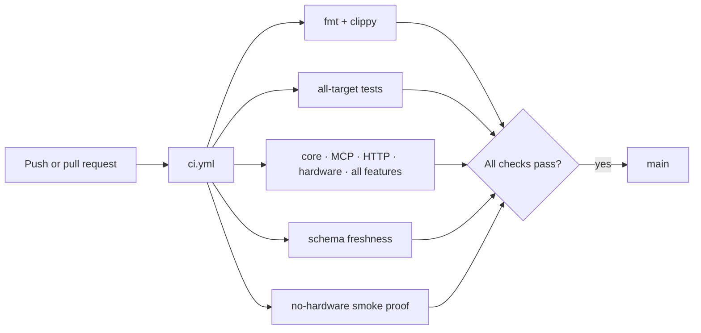
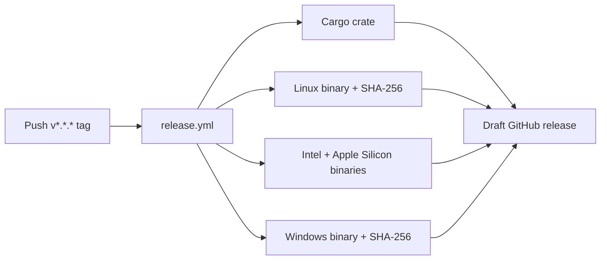

# GitHub automation

This folder turns a proposed Leash change into verified Rust artifacts. Pull
requests and pushes run the safety-oriented build matrix; version tags add the
packaging and draft-release path.





## How to use it

Before opening a pull request, run the same core checks locally:

```bash
cargo fmt --check
cargo clippy --all-targets --all-features -- -D warnings
cargo test --all-targets --all-features
cargo run --features mcp --bin leash-schema -- --check
scripts/smoke-all.sh
```

- [`workflows/ci.yml`](workflows/ci.yml) runs on every push and pull request.
- [`workflows/release.yml`](workflows/release.yml) runs for version tags or a
  manual dispatch and produces a draft release for review.
- Runtime behavior belongs in `src/`; operator and protocol guidance belongs in
  `docs/`. This folder should contain repository automation only.
