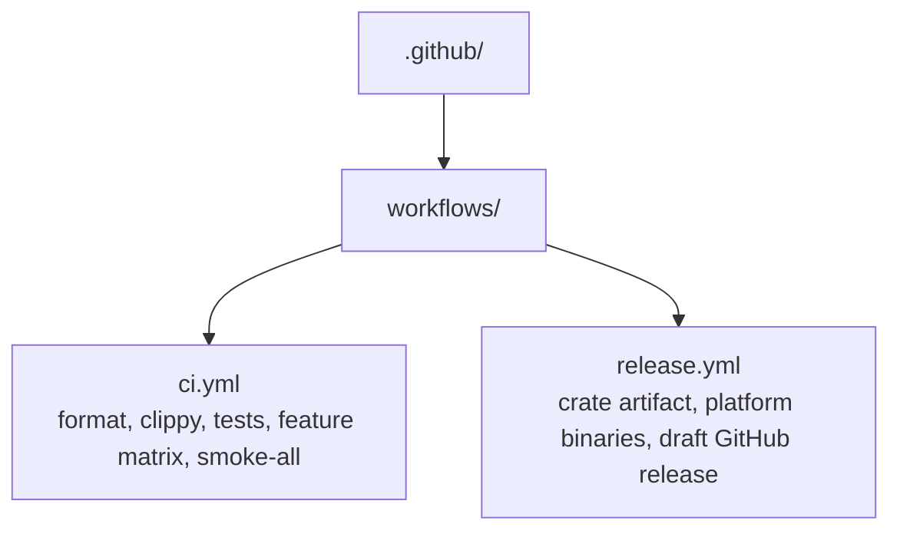

# .github

This folder holds GitHub automation for Leash. Keep repository-level automation here rather than mixing CI or release behavior into runtime docs.

## Contents

- `workflows/`: GitHub Actions workflow definitions for pull requests, pushes, tags, and manual release runs.
