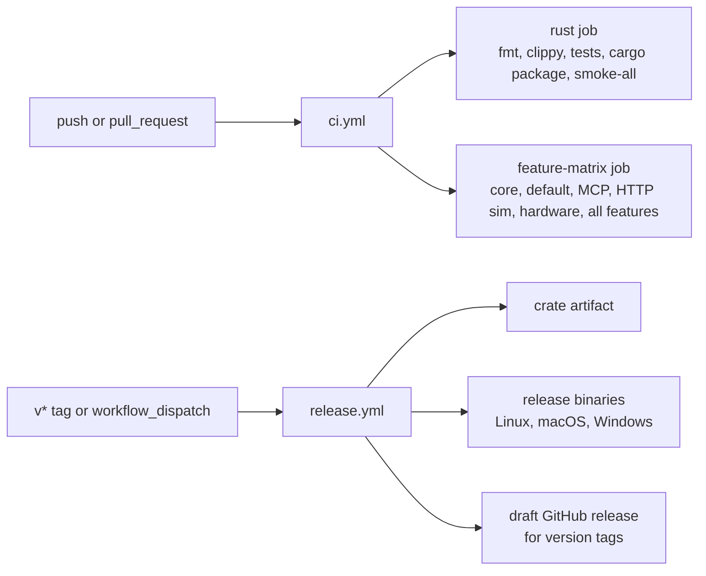

# GitHub Workflows

This folder defines the remote validation and release path.

## Files

- `ci.yml`: required correctness path for ordinary changes.
- `release.yml`: packaging path for crates.io artifacts, binary archives, checksums, and draft GitHub releases.
