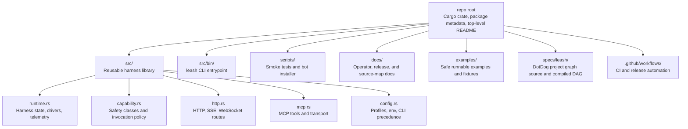
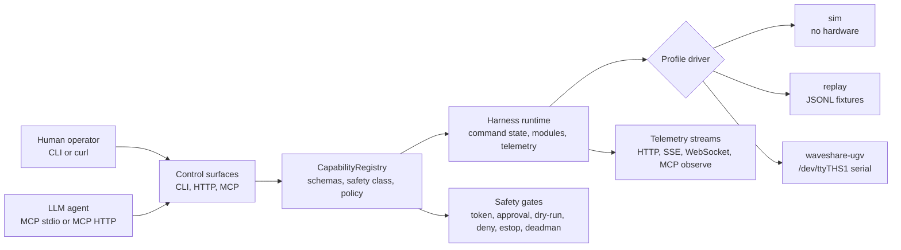

# leash

> Composable local-LLM and robotics harness. Rust-first, MCP-first, simulation-safe.

Leash is a Rust harness runtime that lets LLM agents control robots through typed modules, safety gates, and a shared capability registry. Run in simulation with zero hardware, or connect physical robots behind explicit actuation gates.

```bash
cargo install leash-harness
leash list               # built-in stacks
leash run sim-mcp        # MCP stdio for LLM agents
leash run sim-http       # localhost HTTP + WebSocket
leash serve mcp-http     # localhost MCP JSON control surface
```

## Why Leash

- **Simulation-safe by default.** CI, demos, and smoke tests require zero hardware. Physical actuation is an explicit opt-in gate.
- **MCP-native.** Agents get 8 typed tools (health, capabilities, modules, observe, invoke_capability, stop, estop, capture) over stdio or localhost MCP HTTP.
- **Safety gates at every layer.** Deadman switch, estop, soft odometry limits, physical actuation gate. Policy-gated capability invocation.
- **Feature-gated hardware.** Waveshare UGV today, MAVLink drone + manipulator planned. No hardware compiles without explicit `--features`.
- **Stack catalog.** Runnable sim, MCP, HTTP, and compatibility demos. `leash list` + `leash run <stack>`.
- **Module graph with typed streams.** Modules declare inputs, outputs, lifecycle, health, and selected stream transport. Coordinator manages startup/shutdown order.
- **Local stream transport.** Module streams can use `local-pubsub` for async fan-out or `memory` for deterministic tests.
- **Deterministic replay.** JSONL record/replay fixtures can drive HTTP and MCP observe paths in non-physical replay mode.
- **Control boundary.** Leash provides the hardware and runtime-control adapter layer: typed capabilities, safety gates, simulation defaults, telemetry, and explicit control authority.

## Product primitive

Leash is a control adapter, not the top-level doctrine. It exposes physical and runtime capabilities through typed commands, safety gates, telemetry, replay, and explicit authority checks. Higher-level products can use it as an execution surface while keeping planning, context, and durable software state outside the hardware boundary.

## Repository Map



## Runtime Map



## Quick Start

```bash
# Install
cargo install leash-harness

# List built-in stacks
leash list

# Run MCP in simulation (zero hardware)
leash run sim-mcp

# Run with HTTP + WebSocket
leash run sim-http
leash agent-send "inspect the battery"
leash agent-interactive

# Run as a daemon and inspect JSONL logs
leash run sim-http --daemon
leash log sim-http --json --module http --lines 20

# Run MCP HTTP for agent or CLI tooling
leash serve mcp-http --listen 127.0.0.1:9990

# Check health
leash health --url http://127.0.0.1:8000

# Replay a deterministic fixture
leash replay examples/replay/sim-basic.jsonl --speed 10
```

## MCP Tools

| Tool | Description |
|------|-------------|
| `health` | Harness health and safety state |
| `capabilities` | Endpoints, MCP tools, speed modes |
| `modules` | Module graph and stream metadata |
| `observe` | Latest telemetry frame (odometry, battery, sensors) |
| `invoke_capability` | authorize, drive, stop, estop, estop_reset, speed_mode |
| `stop` | Non-latching zero-speed motor stop |
| `estop` | Latch emergency stop until reset |
| `capture` | Deterministic frame capture |

## MCP HTTP And CLI

```bash
leash serve mcp-http --listen 127.0.0.1:9990
leash mcp list-tools
leash mcp status --url http://127.0.0.1:9990
leash mcp modules
leash mcp call health
leash mcp call invoke_capability capability=authorize token=demo ttl_secs=30
leash mcp call invoke_capability --json '{"capability":"speed_mode","speed_mode":"low"}'
```

`/mcp/tools`, `/mcp/status`, `/mcp/modules`, and `/mcp/call` return JSON for
local agents and automation. Module/tool mapping exposes tool names by module
without returning pilot session tokens.

## HTTP Endpoints

```
GET  /health              Harness health
GET  /capabilities         Endpoints + tools + stream transport
GET  /telemetry            Latest TelemetryFrame
GET  /events/telemetry     Server-sent telemetry stream
GET  /sse/telemetry        Alias for /events/telemetry
GET  /agent                Local web input form
GET  /agent/messages       Recent agent input messages
POST /agent/messages       { source, text }
POST /drive               { token, left, right, speed_mode, approval }
POST /estop                Latch emergency stop
POST /estop/reset          { token, approval } Clear estop
WS   /ws/telemetry         Streaming telemetry envelope frames
```

## Agent Input

Run a local HTTP stack, then send natural-language text into the runtime without
requiring a model provider:

```bash
leash run sim-http
leash agent-send "inspect the battery"
printf 'look for obstacles\n/quit\n' | leash agent-interactive
```

`POST /agent/messages` records a bounded recent inbox and publishes each message
on the `agent` stream for local subscribers. The web form at `/agent` is only
available when the `http` feature is built, and Leash binds HTTP to
`127.0.0.1:8000` by default.

## Agent Model Providers

Leash defaults to `deterministic-test`, a no-network provider for CI and demos.
It returns a stable synthetic response with each agent input acknowledgement.
Hosted and local HTTP providers can be configured and validated without printing
secrets:

```bash
LEASH_AGENT_API_KEY=... \
  leash show-config \
  --agent-provider openai-compatible-http \
  --agent-base-url https://example.test/v1 \
  --agent-model demo-model

leash show-config \
  --agent-provider local-http \
  --agent-base-url http://127.0.0.1:11434/v1
```

Provider settings are available as `--agent-provider`, `--agent-model`,
`--agent-base-url`, `--agent-api-key`, and `--agent-timeout-ms`, or via matching
`LEASH_AGENT_*` environment variables. `agent_api_key` is redacted from
`show-config` fields and omitted from top-level serialized config output.

## Safety Policy

Capability invocations carry safety classes: `observe-only`, `sim-control`,
`physical-stop`, `physical-motion`, and `physical-high-risk`. `drive` is
`physical-motion`; `stop` and `estop` are `physical-stop`; `estop_reset` is
`physical-high-risk`.

`--policy-mode` and `LEASH_POLICY_MODE` support:

- `require-token` (default): physical motion and high-risk calls need a token.
- `require-approval`: physical motion and high-risk calls need `approval=true`.
- `dry-run`: physical motion and high-risk calls return a dry-run result without
  changing command state.
- `deny`: physical motion and high-risk calls are blocked.

`stop` and `estop` remain available under restrictive policy modes. Approved and
denied physical actions are emitted as structured log events. Agent-origin
physical motion always requires `approval=true`; physical profiles still require
`--allow-physical-actuation` or `LEASH_ALLOW_PHYSICAL_ACTUATION=1` before the
harness starts.

## Features

| Feature | Description | Default |
|---------|-------------|---------|
| `sim` | Simulation driver (no hardware) | ✓ |
| `http` | HTTP server + WebSocket | ✓ |
| `mcp` | MCP stdio server | ✓ |
| `waveshare-ugv` | Waveshare UGV physical adapter | opt-in |
| `bridge-compat` | Legacy robot bridge compatibility | opt-in |

## Smoke Tests

```bash
scripts/smoke-all.sh
```

`scripts/smoke-all.sh` runs the no-hardware release proof and prints a JSON
summary covering HTTP routes and policy denial, stdio MCP, physical-gate
refusal, daemon lifecycle, graph export, MCP HTTP + CLI calls, replay HTTP/MCP
observe paths, and config preflight checks.

## Stream Transport

`stream_transport` selects the module-stream backend used by WebSocket and SSE
telemetry streams and shown in graph and capability output:

- `local-pubsub` is the default runtime backend. It uses bounded async broadcast
  channels, supports fan-out across local tasks, drops oldest messages under
  receiver lag, and reports lag to subscribers.
- `memory` is an unbounded in-process backend for deterministic tests and local
  harness checks. Dropped subscribers are pruned on publish.

Use `--stream-transport memory` or `LEASH_STREAM_TRANSPORT=memory` when a run
needs deterministic in-process delivery.

`/ws/telemetry`, `/events/telemetry`, and `/sse/telemetry` emit the same
transport-backed envelope: latest telemetry, health/module state, command state,
and safety state.

## Run Logs and Resource Samples

Daemon runs write structured JSONL logs under the Leash state directory. Each
entry includes `timestamp`, `run_id`, `module`, `event`, `level`, and any
structured fields emitted with the tracing event:

```bash
leash run sim-http --daemon
leash log sim-http --json --module http --lines 20
```

Runtime telemetry keeps process resource sampling off by default. Enable it for
development or field debugging with `--resource-sampling` or
`LEASH_RESOURCE_SAMPLING=1`; use `--no-resource-sampling` to force it off when
an environment or config file enables it.

`leash_harness::stream_processing` provides generic helpers for high-rate
streams: latest-value backpressure, per-key rate limiting, quality filtering,
and timestamp pairing within a tolerance window.

## Replay

`leash record` writes compact `leash-replay-v1` JSONL events for telemetry,
sensors, camera status, and command state. `leash replay` emits those events
with original timing, scaled by `--speed`:

```bash
leash record --output /tmp/leash-demo.jsonl --samples 10 --interval-ms 50
leash replay /tmp/leash-demo.jsonl --speed 20
```

Use a replay source to serve deterministic observations through the normal HTTP
and MCP surfaces without hardware:

```bash
leash serve http --replay-source examples/replay/sim-basic.jsonl
leash serve mcp --replay-source examples/replay/sim-basic.jsonl
```

Replay mode resolves to `profile: replay`, `mode: replay`, `replay: true`, and
`physical: false` / `physical_actuation_enabled: false` in config, health, and
capability output.

Run narrower checks when you need to isolate one surface:

```bash
scripts/smoke-http.sh
scripts/smoke-mcp.sh
scripts/smoke-mcp-http.sh
scripts/smoke-replay-http.sh
scripts/smoke-replay-mcp.sh
scripts/smoke-physical-gate.sh
scripts/smoke-daemon.sh
```

## Roadmap

See [issues](https://github.com/specdog/leash/issues) for the full plan. Highlights:

- [x] Module graph with typed streams, lifecycle, and health aggregation
- [x] Stack catalog: `leash list` + `leash run`
- [x] Replay engine: deterministic sensor record + playback
- [x] Transport abstraction: memory + local async pubsub
- [x] Stream processing helpers: latest-value backpressure, quality filters, timestamp pairing
- [x] Agent input channels: one-shot CLI, interactive CLI, and localhost web input
- [ ] Cross-process and network transports
- [ ] MAVLink drone + manipulator adapters
- [ ] Localhost command center dashboard
- [ ] Spatial memory and perception primitives
- [ ] Patrol and exploration in simulation
- [x] Full no-hardware smoke suite

## License

MIT
