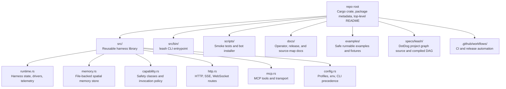
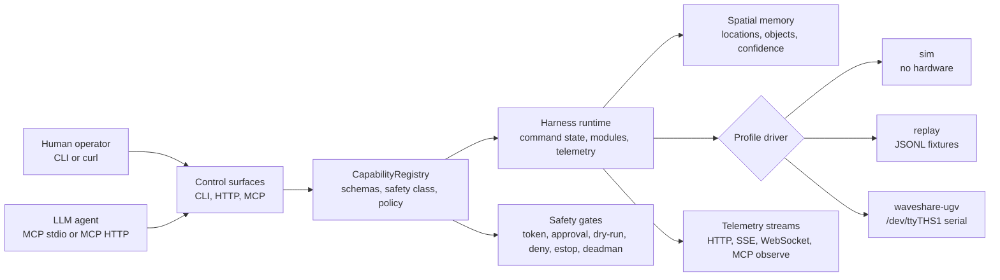

# leash

> Composable local-LLM and robotics harness. Rust-first, MCP-first, simulation-safe.

Leash is a Rust harness runtime that lets LLM agents control robots through typed modules, safety gates, and a shared capability registry. Run in simulation with zero hardware, or connect physical robots behind explicit actuation gates.

```bash
cargo install leash-harness
leash list               # built-in stacks
leash run sim-mcp        # MCP stdio for LLM agents
leash run sim-http       # localhost HTTP + WebSocket
leash run sim-stream-hub # localhost TCP JSONL stream hub
leash serve mcp-http     # localhost MCP JSON control surface
leash worker run -- node -e 'setInterval(() => {}, 1000)'
```

## Why Leash

- **Simulation-safe by default.** CI, demos, and smoke tests require zero hardware. Physical actuation is an explicit opt-in gate.
- **MCP-native.** Agents get 8 typed tools (health, capabilities, modules, observe, invoke_capability, stop, estop, capture) over stdio or localhost MCP HTTP.
- **Safety gates at every layer.** Deadman switch, estop, soft odometry limits, physical actuation gate. Policy-gated capability invocation.
- **Feature-gated hardware.** Waveshare UGV today, MAVLink drone + manipulator planned. No hardware compiles without explicit `--features`.
- **Stack catalog.** Runnable sim, MCP, HTTP, and compatibility demos. `leash list` + `leash run <stack>`.
- **Module graph with typed streams.** Modules declare inputs, outputs, lifecycle, health, and selected stream transport. Coordinator manages startup/shutdown order.
- **Local stream transport.** Module streams can use `local-pubsub` for async fan-out or `memory` for deterministic tests.
- **Spatial memory primitives.** Agents can tag, query, list, and clear file-backed location/object memory isolated by run/profile.
- **Deterministic replay.** JSONL record/replay fixtures can drive HTTP and MCP observe paths in non-physical replay mode.

## Repository Map



## Runtime Map



## Quick Start

```bash
# Install
cargo install leash-harness

# List built-in stacks
leash list

# Run MCP in simulation (zero hardware)
leash run sim-mcp

# Run with HTTP + WebSocket
leash run sim-http
leash agent-send "inspect the battery"
leash agent-interactive

# Run a TCP JSONL stream hub for external module processes
leash run sim-stream-hub

# Start and supervise an explicit external worker process
leash worker run --name demo-worker -- node -e 'setInterval(() => {}, 1000)'

# Run as a daemon and inspect JSONL logs
leash run sim-http --daemon
leash log sim-http --json --module http --lines 20

# Run MCP HTTP for agent or CLI tooling
leash serve mcp-http --listen 127.0.0.1:9990

# Check health
leash health --url http://127.0.0.1:8000

# Replay a deterministic fixture
leash replay examples/replay/sim-basic.jsonl --speed 10
```

## MCP Tools

| Tool | Description |
|------|-------------|
| `health` | Harness health and safety state |
| `capabilities` | Endpoints, MCP tools, speed modes |
| `modules` | Module graph and stream metadata |
| `observe` | Latest telemetry frame (odometry, battery, sensors) |
| `invoke_capability` | authorize, drive, stop, estop, estop_reset, speed_mode, planner_set_goal, planner_cancel, planner_status, start_patrol, stop_patrol, patrol_status, memory_tag_location, memory_list, memory_query, memory_clear |
| `stop` | Non-latching zero-speed motor stop |
| `estop` | Latch emergency stop until reset |
| `capture` | Deterministic frame capture |

## MCP HTTP And CLI

```bash
leash serve mcp-http --listen 127.0.0.1:9990
leash mcp list-tools
leash mcp status --url http://127.0.0.1:9990
leash mcp modules
leash mcp call health
leash mcp call invoke_capability capability=authorize token=demo ttl_secs=30
leash mcp call invoke_capability --json '{"capability":"speed_mode","speed_mode":"low"}'
leash mcp call invoke_capability --json '{"capability":"planner_set_goal","x_m":0.25,"y_m":0.0,"speed_mode":"low"}'
leash mcp call invoke_capability capability=planner_status
leash mcp call invoke_capability --json '{"capability":"start_patrol","strategy":"coverage","speed_mode":"low"}'
leash mcp call invoke_capability capability=stop_patrol
leash mcp call invoke_capability --json '{"capability":"memory_tag_location","name":"dock","x_m":0.25,"y_m":0.0,"confidence":0.95}'
leash mcp call invoke_capability capability=memory_query query=dock
```

`/mcp/tools`, `/mcp/status`, `/mcp/modules`, and `/mcp/call` return JSON for
local agents and automation. Module/tool mapping exposes tool names by module
without returning pilot session tokens.

## Sim Planner And Patrol

The sim profile includes a small `map`-frame waypoint router over a fixed 2D
occupancy grid. Use `planner_set_goal` to request a local goal, `planner_status`
to read the current path and last drive command, and `planner_cancel` or any stop
or estop path to end planner motion.

Patrol builds on the same router with `start_patrol`, `stop_patrol`, and
`patrol_status`. Strategies are `coverage`, `frontier`, and `random`; the runtime
tracks visited cells, filters patrol goals through the sim clearance mask, and
emits the active patrol goal/path in telemetry visualization frames.

Planner movement calls the same `drive` capability as manual control, so speed
caps, deadman state, estop state, and the soft odometry limit still apply. The
router and patrol loop are sim-only demo surfaces.

## Spatial Memory

Leash keeps a small file-backed spatial memory store for named `location` and
`object` entries. Each entry records `name`, `kind`, `frame_id`, `x_m`, `y_m`,
`observed_at_ms`, `updated_at_ms`, `confidence`, `effective_confidence`, and a
`stale` flag. The default path is under the Leash state directory:

```text
$LEASH_STATE_DIR/memory/<profile>/<role>/<run-id>.json
```

When `LEASH_STATE_DIR` is not set, the same state-root rules as daemon logs are
used. Non-daemon runs get a process-local run id; daemon runs use
`LEASH_RUN_ID`, so memory remains isolated by run/profile by default.

Use `memory_tag_location` to add or update a named place. Pass
`kind=object` to track an observed object with the same store and update
semantics:

```bash
leash mcp call invoke_capability --json '{"capability":"memory_tag_location","name":"dock","frame_id":"map","x_m":0.25,"y_m":0.0,"confidence":0.95}'
leash mcp call invoke_capability --json '{"capability":"memory_tag_location","name":"cone","kind":"object","frame_id":"map","x_m":0.4,"y_m":0.5,"confidence":0.8}'
leash mcp call invoke_capability --json '{"capability":"memory_query","query":"dock","min_confidence":0.9}'
leash mcp call invoke_capability capability=memory_list
leash mcp call invoke_capability capability=memory_clear
```

## HTTP Endpoints

```
GET  /                    Local command center dashboard
GET  /dashboard            Local command center dashboard
POST /dashboard/authorize  Authorize pilot token from dashboard form
POST /dashboard/stop       Stop through shared capability registry
POST /dashboard/estop      Latch estop through shared capability registry
POST /dashboard/estop-reset  Clear estop through shared capability registry
POST /dashboard/capture    Capture frame through shared capability registry
GET  /health              Harness health
GET  /capabilities         Endpoints + tools + stream transport
GET  /telemetry            Latest TelemetryFrame
GET  /events/telemetry     Server-sent telemetry stream
GET  /sse/telemetry        Alias for /events/telemetry
GET  /agent                Local web input form
GET  /agent/messages       Recent agent input messages
POST /agent/messages       { source, text }
POST /drive               { token, left, right, speed_mode, approval }
POST /estop                Latch emergency stop
POST /estop/reset          { token, approval } Clear estop
WS   /ws/telemetry         Streaming telemetry envelope frames
```

## External Schemas And Clients

Leash publishes generated JSON Schema for external tools at
`schemas/leash-messages.schema.json`. Regenerate it from Rust wire types with:

```bash
cargo run --features mcp --bin leash-schema -- --output schemas/leash-messages.schema.json
```

CI checks schema freshness with `--check`, and
[docs/SCHEMAS.md](docs/SCHEMAS.md) documents compatibility rules. Standard-library
Python and Node examples in `examples/clients/` read `/health`, consume
`/telemetry`, and invoke `POST /stop` against sim HTTP.

## Viewer Frames

`WS /ws/telemetry`, `GET /events/telemetry`, and `GET /sse/telemetry` emit
`TelemetryStreamFrame` JSON. Each frame includes a versioned
`visualization.version = "leash-visualization-v1"` payload with:

- `map`: map ID, frame ID, dimensions, resolution, origin, and cell order
- `pose`: timestamped map-frame 2D pose
- `twist`: timestamped base-link linear/angular velocity
- `path`: timestamped viewer-ready pose list
- `occupancy_grid`: compact grid metadata + `-1..100` cells, where `-1` is unknown and `100` is occupied
- `costmap`: compact grid metadata + `0..255` costs, where `0` is free, `254` is lethal, and `255` is unknown
- `point_cloud`: metadata only, no viewer dependency
- `detections`: generic detection boxes
- `command`: motor command overlay for operators
- `autonomy`: active patrol mode, strategy, goal, and visited cells

Frame conventions are deliberately small: `map` is the global 2D frame for
poses, paths, occupancy grids, and costmaps; `base_link` is the robot-local
frame for twist and point-cloud metadata; `camera` is used for image-space
detections. Grid cells are row-major from the map origin at `origin`, with
meters-per-cell in `resolution_m`.

External viewers can subscribe to the stream endpoints and render those fields
without linking a viewer SDK into the core crate.

## Perception Boundary

Telemetry includes a `vision` result with `ok`, `status`, `source`,
`observed_at_ms`, `duration_ms`, `detections`, and `error`. `observe` returns the
same telemetry shape over HTTP and MCP, so sim and replay observe calls include
deterministic fake detections for demos and CI.

Core owns the `ImageObservation`, `DetectionFrame`, and `VisionResult` schemas
plus timeout/panic/error isolation. Heavy providers should live outside the core
crate behind the perception adapter boundary. A local HTTP provider can mirror
the trait contract with:

```http
POST /detect
content-type: application/json

{
  "ts_ms": 42,
  "frame_id": "camera",
  "source": "sim",
  "width_px": 640,
  "height_px": 480,
  "content_type": "image/simulated",
  "byte_len": 0,
  "sha256": null
}
```

and return a `VisionResult`. Provider failures should be converted to
`ok=false` results with `status` values such as `error`, `panic`, or `timeout`;
they must not crash the runtime or block physical safety policy.

## Agent Input

Run a local HTTP stack, then send natural-language text into the runtime without
requiring a model provider:

```bash
leash run sim-http
leash agent-send "inspect the battery"
printf 'look for obstacles\n/quit\n' | leash agent-interactive
```

The command center at `/dashboard` is server-rendered HTML with regular form
posts for authorize, stop, estop, reset, and capture actions. Those forms call
the same shared capability registry used by JSON HTTP, CLI, and MCP paths.
`POST /agent/messages` records a bounded recent inbox and publishes each message
on the `agent` stream for local subscribers. The web form at `/agent` is only
available when the `http` feature is built, and Leash binds HTTP to
`127.0.0.1:8000` by default.

## Agent Model Providers

Leash defaults to `deterministic-test`, a no-network provider for CI and demos.
It returns a stable synthetic response with each agent input acknowledgement.
Hosted and local HTTP providers can be configured and validated without printing
secrets:

```bash
LEASH_AGENT_API_KEY=... \
  leash show-config \
  --agent-provider openai-compatible-http \
  --agent-base-url https://example.test/v1 \
  --agent-model demo-model

leash show-config \
  --agent-provider local-http \
  --agent-base-url http://127.0.0.1:11434/v1
```

Provider settings are available as `--agent-provider`, `--agent-model`,
`--agent-base-url`, `--agent-api-key`, and `--agent-timeout-ms`, or via matching
`LEASH_AGENT_*` environment variables. `agent_api_key` is redacted from
`show-config` fields and omitted from top-level serialized config output.

## Safety Policy

Capability invocations carry safety classes: `observe-only`, `sim-control`,
`physical-stop`, `physical-motion`, and `physical-high-risk`. `drive` is
`physical-motion`; `stop` and `estop` are `physical-stop`; `estop_reset` is
`physical-high-risk`.

`--policy-mode` and `LEASH_POLICY_MODE` support:

- `require-token` (default): physical motion and high-risk calls need a token.
- `require-approval`: physical motion and high-risk calls need `approval=true`.
- `dry-run`: physical motion and high-risk calls return a dry-run result without
  changing command state.
- `deny`: physical motion and high-risk calls are blocked.

`stop` and `estop` remain available under restrictive policy modes. Approved and
denied physical actions are emitted as structured log events. Agent-origin
physical motion always requires `approval=true`; physical profiles still require
`--allow-physical-actuation` or `LEASH_ALLOW_PHYSICAL_ACTUATION=1` before the
harness starts.

## Adapter Profile Matrix

`leash list` and `/capabilities` expose adapter metadata so new hardware paths
can declare their own category, maturity, feature flags, capability set, and
required gates without changing core command safety policy.

| Adapter | Category | Maturity | Feature flags | Required gates |
|---------|----------|----------|---------------|----------------|
| sim | `simulation` | `stable` | `sim` | none |
| replay | `simulation` | `beta` | none | none |
| bridge compatibility | `compatibility` | `beta` | `sim`, `bridge-compat` | none |
| Waveshare UGV | `mobile-base` | `alpha` | `waveshare-ugv` | `physical-actuation`, `policy-token-or-approval` |
| MAVLink drone | `drone` | `experimental` | `mavlink-drone` | `physical-actuation`, `policy-token-or-approval` |
| manipulator | `manipulator` | `experimental` | `manipulator` | `physical-actuation`, `policy-token-or-approval` |

Maturity levels are:

- `stable`: default path for CI, demos, or documented local use.
- `beta`: useful but still compatibility- or fixture-scoped.
- `alpha`: working adapter path with explicit safety and operator assumptions.
- `experimental`: exploratory boundary for future providers.

Core owns the capability registry, safety classes, policy modes, config
resolution, transport, telemetry, and no-hardware release proof. Feature or
example adapter crates should own hardware protocols, device discovery,
calibration, planning/IK stacks, provider retries, and any native SDK bindings.
Physical adapters must declare `physical-actuation` in `required_gates`; flight,
joint, and other high-risk adapters should also declare the policy approval or
token gate their commands require.

## Features

| Feature | Description | Default |
|---------|-------------|---------|
| `sim` | Simulation driver (no hardware) | ✓ |
| `http` | HTTP server + WebSocket | ✓ |
| `mcp` | MCP stdio server | ✓ |
| `waveshare-ugv` | Waveshare UGV physical adapter | opt-in |
| `mavlink-drone` | MAVLink drone adapter skeleton, sim/replay proof, and gated physical profile | opt-in |
| `manipulator` | Manipulator adapter skeleton, mock arm teleop, and gated physical profile | opt-in |
| `bridge-compat` | Legacy robot bridge compatibility | opt-in |

## MAVLink Drone Skeleton

The `mavlink-drone` feature adds a no-hardware integration boundary for future
flight adapters. It exposes drone capabilities for arm, disarm, takeoff, land,
move velocity, fly-to, observe, and stop without pulling in a flight stack or
opening a MAVLink connection by default.

```bash
cargo run --features mavlink-drone -- list
cargo run --features mavlink-drone -- run mavlink-drone-sim
cargo run --features mavlink-drone -- run mavlink-drone-replay --replay-source examples/replay/sim-basic.jsonl
```

The physical stack is intentionally gated and needs both explicit actuation and
network endpoint configuration before startup:

```bash
LEASH_ALLOW_PHYSICAL_ACTUATION=1 \
LEASH_MAVLINK_ENDPOINT=udp://127.0.0.1:14550 \
cargo run --features mavlink-drone -- run mavlink-drone-http --allow-physical-actuation
```

Flight capabilities remain policy-gated high-risk actions. The current physical
profile is a skeleton and refuses real flight command execution until a concrete
MAVLink adapter is wired behind this boundary.

## Manipulator Skeleton

The `manipulator` feature adds a mock arm teleop boundary for joint state,
joint command, pose command, home, and stop flows. Joint and pose command
responses carry the `leash-manipulator-v1` schema version so clients can pin
against the skeleton while a real IK or planning provider is still external.

```bash
cargo run --features manipulator -- list
cargo run --features manipulator -- run manipulator-sim
cargo run --features manipulator -- run manipulator-replay --replay-source examples/replay/sim-basic.jsonl
```

Physical manipulator startup is gated just like other physical adapters:

```bash
LEASH_ALLOW_PHYSICAL_ACTUATION=1 \
cargo run --features manipulator -- run manipulator-http --allow-physical-actuation
```

The current physical profile is a skeleton and refuses real joint or pose
execution until a concrete adapter is wired. IK, collision checking, motion
planning, retries, calibration, and native SDK bindings belong out-of-process or
in a future feature/example adapter crate, not in the core command registry.

## Smoke Tests

```bash
scripts/smoke-all.sh
```

`scripts/smoke-all.sh` runs the no-hardware release proof and prints a JSON
summary covering HTTP routes and policy denial, stdio MCP, physical-gate
refusal, daemon lifecycle, graph export, MCP HTTP + CLI planner/patrol/memory
calls, replay HTTP/MCP observe paths, and config preflight checks.

## Stream Transport

`stream_transport` selects the module-stream backend used by WebSocket and SSE
telemetry streams and shown in graph and capability output:

- `local-pubsub` is the default runtime backend. It uses bounded async broadcast
  channels, supports fan-out across local tasks, drops oldest messages under
  receiver lag, and reports lag to subscribers.
- `memory` is an unbounded in-process backend for deterministic tests and local
  harness checks. Dropped subscribers are pruned on publish.

Use `--stream-transport memory` or `LEASH_STREAM_TRANSPORT=memory` when a run
needs deterministic in-process delivery.

`/ws/telemetry`, `/events/telemetry`, and `/sse/telemetry` emit the same
transport-backed envelope: latest telemetry, health/module state, command state,
and safety state.

For out-of-process modules, `leash_harness::transport` also exposes a versioned
TCP JSONL frame contract: `NetworkStreamFrame` with
`schema_version = "leash-stream-jsonl-v1"`, `stream`, and `payload`. The helper
functions `send_tcp_jsonl_stream_message` and
`accept_tcp_jsonl_stream_message` prove one-message loopback delivery without
changing the default runtime transport.

Use `spawn_tcp_jsonl_stream_hub` when a runtime should accept long-lived
localhost TCP peers and publish each valid JSONL frame into the selected
in-process `StreamTransport`. Bad frames close only the offending peer and
increment hub rejection status; the listener keeps serving later peers. This is
the first cross-process stream orchestration layer, not a distributed runtime
supervisor or remote hardware control surface.

Run it from the CLI with:

```bash
leash serve stream-hub --profile sim --listen 127.0.0.1:9970
leash run sim-stream-hub
```

## External Workers

External workers are opt-in child processes. Leash does not start any external
process unless a caller provides the command explicitly. The supervisor records
the worker name, command, restart policy, process-health check, PID, exit code,
restart count, and required/optional metadata.

Run a one-shot supervised worker check:

```bash
leash worker run --name demo-worker --hold-ms 150 -- node -e 'setInterval(() => {}, 1000)'
```

The command prints JSON status while the worker is running, then stops and reaps
the child process before exiting. Restart policy is deliberately small today:
`never` by default, or `on-failure` with `--max-restarts N`.

## Run Logs and Resource Samples

Daemon runs write structured JSONL logs under the Leash state directory. Each
entry includes `timestamp`, `run_id`, `module`, `event`, `level`, and any
structured fields emitted with the tracing event:

```bash
leash run sim-http --daemon
leash log sim-http --json --module http --lines 20
```

Runtime telemetry keeps process resource sampling off by default. Enable it for
development or field debugging with `--resource-sampling` or
`LEASH_RESOURCE_SAMPLING=1`; use `--no-resource-sampling` to force it off when
an environment or config file enables it.

`leash_harness::stream_processing` provides generic helpers for high-rate
streams: latest-value backpressure, per-key rate limiting, quality filtering,
and timestamp pairing within a tolerance window.

## Replay

`leash record` writes compact `leash-replay-v1` JSONL events for telemetry,
sensors, camera status, and command state. `leash replay` emits those events
with original timing, scaled by `--speed`:

```bash
leash record --output /tmp/leash-demo.jsonl --samples 10 --interval-ms 50
leash replay /tmp/leash-demo.jsonl --speed 20
```

Use a replay source to serve deterministic observations through the normal HTTP
and MCP surfaces without hardware:

```bash
leash serve http --replay-source examples/replay/sim-basic.jsonl
leash serve mcp --replay-source examples/replay/sim-basic.jsonl
leash serve mcp-http --replay-source examples/replay/sim-memory.jsonl
```

Replay mode resolves to `profile: replay`, `mode: replay`, `replay: true`, and
`physical: false` / `physical_actuation_enabled: false` in config, health, and
capability output. The `sim-memory.jsonl` fixture is a short deterministic
observe source for demos that tag and recall locations through MCP while replay
telemetry stays stable.

Run narrower checks when you need to isolate one surface:

```bash
scripts/smoke-http.sh
scripts/smoke-mcp.sh
scripts/smoke-mcp-http.sh
scripts/smoke-replay-http.sh
scripts/smoke-replay-mcp.sh
scripts/smoke-physical-gate.sh
scripts/smoke-daemon.sh
```

## Roadmap

See [issues](https://github.com/specdog/leash/issues) for the full plan. Highlights:

- [x] Module graph with typed streams, lifecycle, and health aggregation
- [x] Stack catalog: `leash list` + `leash run`
- [x] Replay engine: deterministic sensor record + playback
- [x] Transport abstraction: memory + local async pubsub
- [x] Stream processing helpers: latest-value backpressure, quality filters, timestamp pairing
- [x] Agent input channels: one-shot CLI, interactive CLI, and localhost web input
- [x] TCP JSONL stream framing for cross-process modules
- [x] Runnable TCP JSONL stream hub for cross-process module links
- [x] External worker lifecycle and supervision
- [ ] MAVLink drone + manipulator adapters
- [x] Localhost command center dashboard
- [x] Viewer-ready visualization frames
- [x] Occupancy-grid and costmap message primitives
- [x] Sim waypoint router and local planner demo
- [x] Patrol and exploration in simulation
- [x] Spatial memory and object registry primitives
- [x] Full no-hardware smoke suite

## License

MIT
