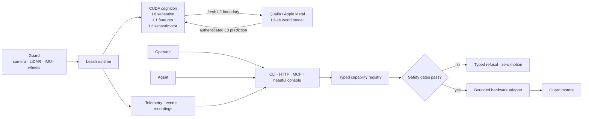
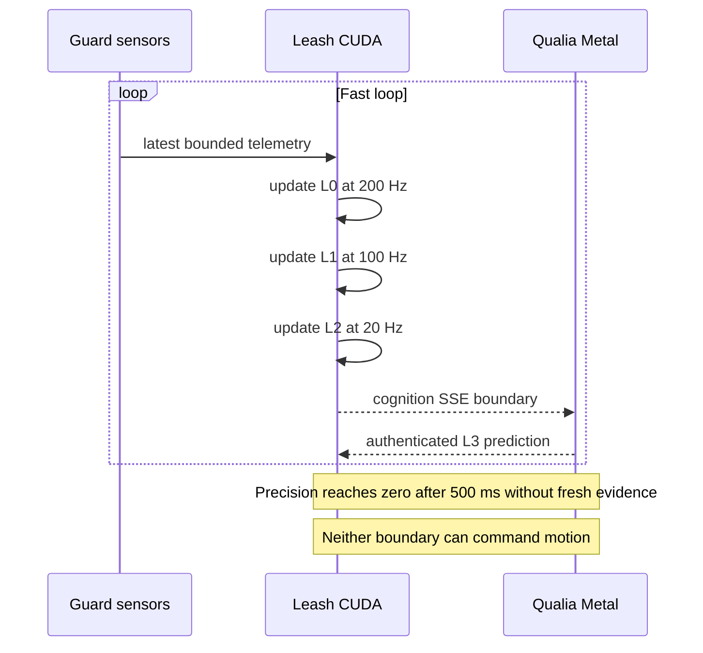
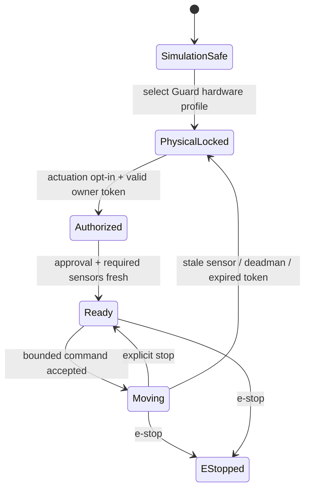
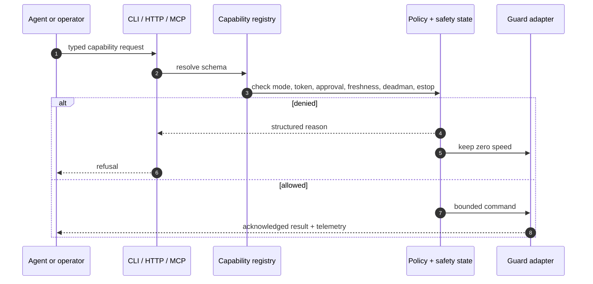

# Leash

Leash is Guard's hardware runtime and safety boundary. It reads the robot,
runs the fast end of Qualia's cognition loop on the Jetson GPU, exposes one
typed control surface, and decides whether a physical command is allowed.

Agents do not get a hidden path to the motors. CLI, HTTP, MCP, the headful
console, and Qualia all converge on the same capability registry and safety
state.



The cognition lane observes and predicts. It has no motor authority. The
actuation lane remains separately gated even when every cognition layer is
healthy.

## Run it without hardware

Build and start the simulated HTTP runtime:

```bash
cargo build --all-features
cargo run --all-features --bin leash -- \
  serve http \
  --role guard \
  --profile sim \
  --listen 127.0.0.1:8000 \
  --accelerator cpu
```

Inspect the same typed state an agent receives:

```bash
curl -s http://127.0.0.1:8000/health | jq
curl -s http://127.0.0.1:8000/telemetry | jq
curl -s http://127.0.0.1:8000/cognition/status | jq
curl -N http://127.0.0.1:8000/events/cognition
```

The simulation path cannot touch physical hardware.

## The Guard cognition boundary

Leash owns layers L0-L2 of the seven-layer Qualia system:

| Layer | Target cadence | Input | Output |
| --- | ---: | --- | --- |
| L0 | 200 Hz | normalized sensor plane | immediate sensation state |
| L1 | 100 Hz | L0 state and prediction | local features and residuals |
| L2 | 20 Hz | L1 plus sensorimotor evidence | boundary exported to Qualia |

These layers consume the generic `TelemetryFrame` contract. `waveshare-ugv` is
Guard's selected hardware adapter, not a cognition fork; simulation, replay,
another mobile base, a drone, or a manipulator can provide the same versioned
evidence through their own adapter.

The sensor plane has exactly 1024 values:

```text
 360  LiDAR ranges
 256  compact camera / detections
 256  occupancy / height evidence
  24  IMU / odometry / last action
  64  freshness and calibration state
  64  reserved zeros
-----
1024
```

CUDA buffers remain allocated across updates. Weights stay on the Jetson; they
are not copied into telemetry. Leash exports only bounded state, precision,
sequence, timestamp, and digest through `qualia.cognition.v1`.



### HTTP

| Endpoint | Purpose |
| --- | --- |
| `GET /cognition/status` | Backends, cadence, freshness, precision, and zero-motion truth |
| `GET /cognition/snapshot` | Compact L0-L2 summaries |
| `GET /events/cognition` | L2 server-sent event stream to Qualia |
| `POST /cognition/boundary` | Authenticated L3 prediction from Qualia |
| `POST /cognition/checkpoint` | Explicitly persist cognition state |

Set `LEASH_COGNITION_INGRESS_TOKEN_FILE` to enable the inbound boundary. The
file must contain the shared token; do not put the token itself in a process
argument, service file, log, or repository.

### MCP

Leash exposes three read/control-plane cognition tools:

- `cognition_status`
- `cognition_snapshot`
- `cognition_checkpoint`

They cannot enable navigation or invoke a motor adapter.

## Headful and headless agent use

Headful mode opens the embedded console for the same runtime state used by the
CLI and MCP surfaces:

```bash
leash agent headful --listen 127.0.0.1:8000
```

On a remote machine use `--no-open`, then open `/agent` through the appropriate
trusted connection. The console shows sessions, model turns, supervised tasks,
live safety state, and observe-only capability probes.

Headless sessions are durable and machine-readable:

```bash
leash agent run "inspect Guard's sensor health" \
  --session guard-check \
  --output streaming-json

leash agent run "summarize the change" \
  --session guard-check \
  --output json

leash agent sessions show guard-check
```

Supervised background tasks can call only registered Leash capabilities:

```bash
leash agent task start \
  --name cognition-watch \
  cognition_status \
  --interval-ms 2000 \
  --allow cognition_status

leash agent task status cognition-watch
leash agent task log cognition-watch --lines 10
leash agent task stop cognition-watch
```

Permission rules narrow which capability may be called. They never bypass the
normal capability policy, robot token, sensor freshness, deadman, or e-stop.

## Safety flow



Physical navigation adds another independent feature and runtime gate. A valid
wheel-odometry estimate does not become a map pose: it stays in the `odom`
frame, its yaw is normalized to `[-pi, pi]`, and stale SLAM remains stale.
Leash does not fabricate an occupancy grid, costmap, or voxel map when mapping
evidence is absent.

## Operator workflow on Guard

The deployed `leash.service` owns the physical runtime. Treat deployment as a
stationary operation:

1. Confirm the motors report zero and stop any active command.
2. Build the release on the Jetson with the required Guard and CUDA features.
3. Keep the previous binary as a rollback artifact.
4. Restart the service without granting new actuation or navigation authority.
5. Prove `/health`, `/cognition/status`, sensor freshness, CUDA backend, and
   zero-motion state before opening the native Qualia app.

Qualia then connects to `GET /events/cognition` and returns its L3 prediction to
the authenticated boundary. The operator sees all seven layers inside the
native Agent / Arena module.

## One request path



## Repository map

- [`src`](src/README.md) — runtime, HTTP, MCP, cognition, sessions, and policy
- [`implementations/waveshare-ugv`](implementations/waveshare-ugv/README.md) — Guard adapter and deployment material
- [`docs`](docs/README.md) — protocols, safety, localization, camera, and release guidance
- [`examples`](examples/README.md) — safe simulations, replay, and integration examples
- [`.github`](.github/README.md) — CI and release automation

## Verify a change

```bash
cargo fmt --check
cargo clippy --all-targets --all-features -- -D warnings
cargo test --all-targets --all-features
cargo run --features mcp --bin leash-schema -- --check
scripts/smoke-all.sh
```

Leash is Apache-2.0 licensed. See [`LICENSE`](LICENSE).
