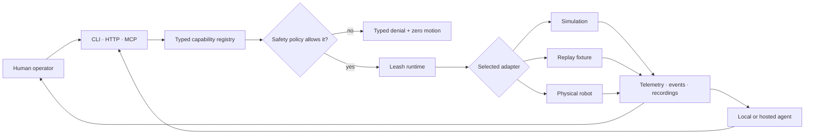
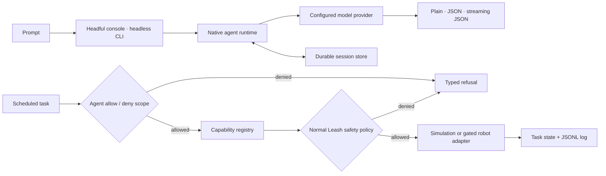
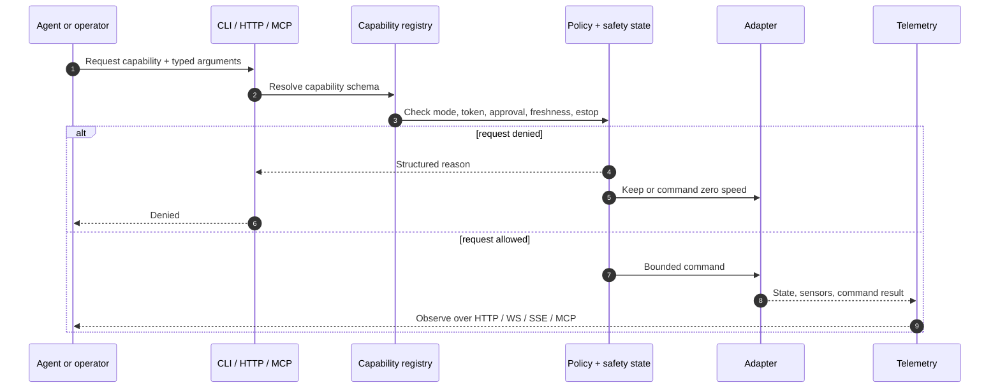
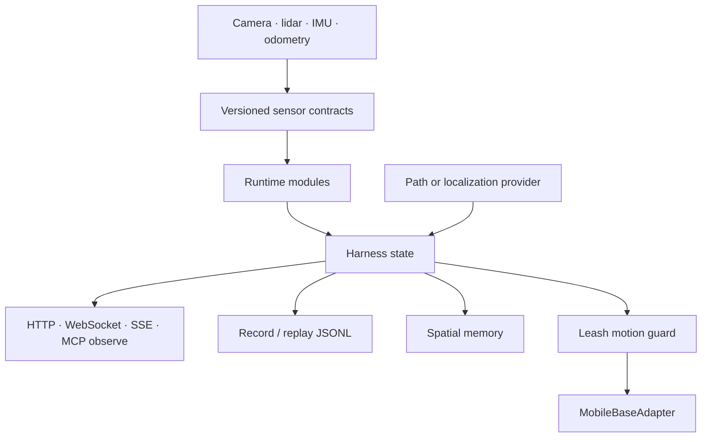
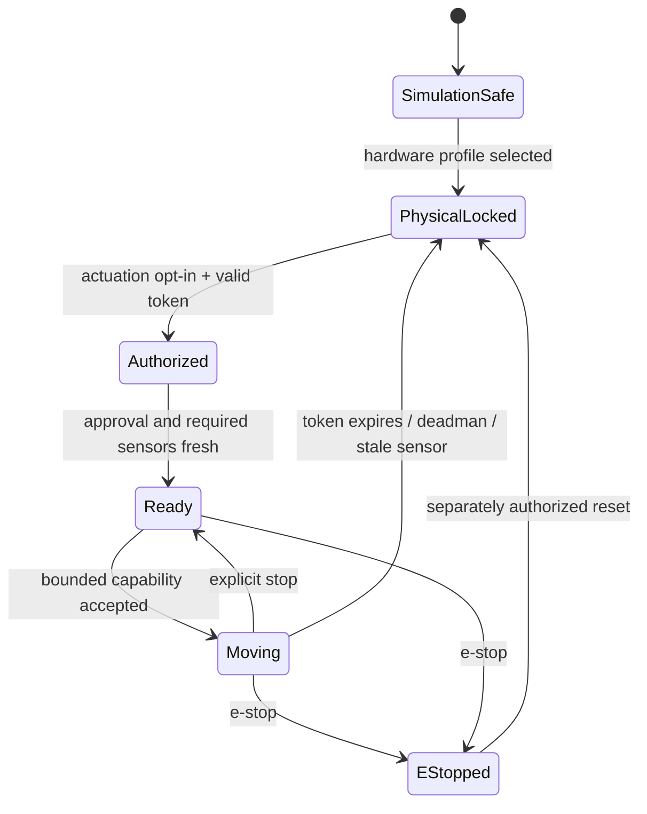
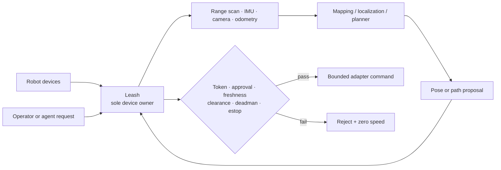
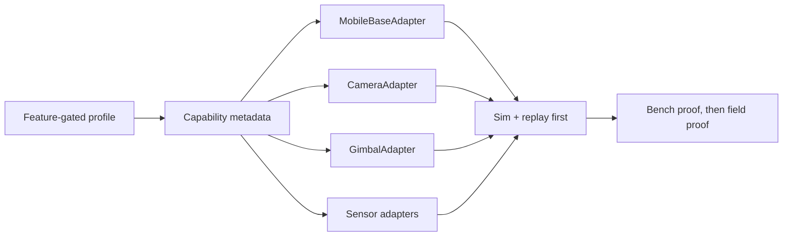

# Leash

> One safe control surface for agents, operators, simulations, and physical robots.

Leash is a Rust robotics harness. An operator or agent asks for an action through
CLI, HTTP, or MCP. Leash validates that request against the same capability and
safety policy, sends an allowed command to a selected adapter, and publishes the
result as typed telemetry.

The important rule is simple: **an AI can request motion; Leash decides whether
motion is allowed.** Simulation works out of the box. Hardware and autonomous
navigation each require separate, explicit gates.



## Try It Safely

Install the CLI and start the simulated HTTP stack:

```bash
cargo install leash-harness
leash run sim-http
```

In another terminal:

```bash
leash health --url http://127.0.0.1:8000
curl -s http://127.0.0.1:8000/telemetry | jq
leash agent-send "inspect the battery"
```

Nothing in that path can touch hardware. To expose the same runtime to an MCP
client instead:

```bash
leash run sim-mcp
```

Or run a local MCP HTTP endpoint and inspect it with the built-in client:

```bash
leash serve mcp-http --listen 127.0.0.1:9990
leash mcp list-tools
leash mcp call health
leash mcp call observe
```

## Pick a Mode

| Goal | Command | Can move hardware? |
| --- | --- | --- |
| Learn the runtime | `leash run sim-http` | No |
| Connect an MCP agent over stdio | `leash run sim-mcp` | No |
| Connect MCP over localhost HTTP | `leash serve mcp-http` | No by default |
| Replay a known sensor session | `leash replay examples/replay/sim-basic.jsonl` | No |
| Fan out module events over JSONL | `leash run sim-stream-hub` | No |
| Start a physical adapter | Feature + runtime actuation opt-in | Only after policy gates pass |

See every built-in stack and its requirements with:

```bash
leash list
leash show-config sim-http
```

## Durable Agent Workflows

Leash includes the useful runtime pieces of a modern coding-agent harness, but
keeps them inside the robot safety boundary: resumable sessions, machine-readable
headless output, scoped permissions, and supervised background tasks. It does
not give the agent an unrestricted shell or a second path to the motors.



Start headful mode when you want to watch the runtime instead of reading JSON
in another terminal. This launches the same native HTTP process and opens the
embedded console—there is no separate frontend service or second agent state:

```bash
leash agent headful --listen 127.0.0.1:8000
```

Open `http://127.0.0.1:8000/agent` if the browser does not open automatically.
Add `--no-open` when starting it on a remote machine. The console shows durable
sessions, live model turns, supervised tasks and their latest JSONL events,
the active safety state, and an observe-only capability probe. It reads and
writes the same `LEASH_STATE_DIR/agent` records as every command below.

Run a named session from a script, then resume it later:

```bash
leash agent run "inspect the battery" \
  --session rover-check \
  --output streaming-json

leash agent run "summarize the last result" \
  --session rover-check \
  --output json

leash agent sessions list
leash agent sessions show rover-check
```

Call one typed capability with a narrow agent scope. Deny rules win over allow
rules, and `*` is supported only as a whole rule or a trailing prefix wildcard:

```bash
leash agent capability call observe --allow observe
leash agent capability call planner_status --allow 'planner_*' --deny planner_cancel
```

Start a capability in a supervised background process. The record and JSONL
log live under `LEASH_STATE_DIR` (or the normal platform state directory), so a
different terminal can inspect or stop it:

```bash
leash agent task start \
  --name planner-watch \
  planner_status \
  --interval-ms 2000 \
  --allow 'planner_*'

leash agent task status planner-watch
leash agent task log planner-watch --lines 10
leash agent task stop planner-watch
```

`--max-runs N` makes a task stop successfully after `N` invocations; zero means
run until stopped. Agent tasks can invoke only registered Leash capabilities.
An agent-origin physical action still needs explicit approval plus every normal
token, runtime, sensor-freshness, deadman, and e-stop check.

| Coding-agent behavior | Leash implementation |
| --- | --- |
| Headful operation | Embedded `/agent` console with live sessions, tasks, safety state, and read-only probes |
| Headless automation | `plain`, `json`, and line-delimited `streaming-json` output |
| Resume a conversation | Named sessions plus `--continue` for the latest session |
| Tool permissions | Deny-wins capability allow/deny patterns |
| Background work | Daemon-backed capability schedules with status, logs, and stop |
| Shell/file/worktree tools | Intentionally excluded from the robot-control runtime |

## What Happens Inside

Every surface—web dashboard, REST endpoint, CLI command, or MCP tool—converges
on the same capability registry. There is no privileged “AI path” around the
safety checks.



Modules declare their inputs, outputs, lifecycle, and health. The coordinator
starts them in dependency order and stops them in reverse order. Streams use
in-memory transport for deterministic tests, local pub/sub for async fan-out,
or a TCP JSONL hub for external processes.



## Safety Is a State Machine

Physical motion is fail-closed. The normal path needs a compiled hardware
adapter, the physical-actuation runtime opt-in, a valid owner token, and any
policy-required approval. Physical goal or patrol execution adds an independent
navigation feature and runtime gate plus fresh localization and lidar.



Stop and e-stop remain available when ordinary commands are denied. Token
replacement, deadman expiry, provider loss, stale lidar, collision clearance,
or an odometry limit cancels active motion and commands zero speed. Replay is
always non-actuating.

Read the full [safety policy](docs/PHYSICAL_NAVIGATION.md) before enabling a
physical navigation path.

## Physical Robot Boundary

Leash owns the device command boundary and final safety decision. Perception,
mapping, localization, and planning providers supply typed evidence; they do
not write motor commands.



The current concrete implementation is the
[Waveshare UGV stack](implementations/waveshare-ugv/README.md). It keeps robot
identity, device paths, calibration evidence, deployment, rollback, and field
proof outside the reusable core. ROS 2 is an implementation adapter for mapping
and localization, never a parallel motor owner.

## Core Surfaces

### MCP tools

| Tool | Purpose |
| --- | --- |
| `health` | Read runtime and safety health |
| `capabilities` | Discover endpoints, tools, modes, and gates |
| `modules` | Inspect the active module graph |
| `observe` | Read the latest typed telemetry frame |
| `invoke_capability` | Request an action through policy |
| `stop` | Command a non-latching zero-speed stop |
| `estop` | Latch emergency stop |
| `capture` | Capture a deterministic frame |

`POST /mcp` implements MCP Streamable HTTP. Compatibility routes remain for
existing local tools. See [the MCP HTTP guide](docs/MCP_HTTP.md).

### HTTP and streams

| Route | Purpose |
| --- | --- |
| `GET /health` | Health and safety snapshot |
| `GET /capabilities` | Active runtime contract |
| `GET /telemetry` | Latest telemetry frame |
| `GET /events/telemetry` | Server-sent telemetry |
| `WS /ws/telemetry` | WebSocket telemetry |
| `POST /drive` | Policy-gated differential drive request |
| `POST /stop` | Shared stop path |
| `POST /estop` | Shared latching e-stop path |
| `GET /camera/snapshot` | One bounded JPEG snapshot |
| `GET /sensors` | Typed sensor status |

### Record and replay

Recordings use the compact `leash-replay-v1` JSONL format. Replay sends those
events through the normal observation surfaces without starting hardware:

```bash
leash record --output /tmp/leash-demo.jsonl --samples 10 --interval-ms 50
leash replay /tmp/leash-demo.jsonl --speed 20
leash serve http --replay-source examples/replay/sim-basic.jsonl
```

## Extending Leash

A new robot implements small adapter contracts below the policy layer:



Start with [the adapter guide](docs/ADAPTERS.md) and its
[smoke-test template](docs/ADAPTER_SMOKE_TEMPLATE.md). New hardware must not
make default builds or tests require a device.

## Repository Guide

```text
src/                         reusable runtime, policy, adapters, protocols
src/bin/                     leash CLI and schema binaries
implementations/             concrete robot implementations and field proof
examples/                    simulation, replay, and client fixtures
docs/                        focused operator and extension guides
schemas/                     generated external JSON Schema
scripts/                     smoke, packaging, and deployment helpers
specs/leash/                 DotDog project graph source and compiled DAG
.github/workflows/           CI and release automation
```

Useful guides:

- [Configuration and adapter contracts](docs/ADAPTERS.md)
- [MCP Streamable HTTP](docs/MCP_HTTP.md)
- [Sensor contracts](docs/SENSORS.md)
- [Localization providers](docs/LOCALIZATION_PROVIDERS.md)
- [Navigation and patrol](docs/NAVIGATION.md)
- [Physical navigation gates](docs/PHYSICAL_NAVIGATION.md)
- [Operator session replay](docs/OPERATOR_SESSIONS.md)
- [Schemas and compatibility](docs/SCHEMAS.md)
- [Release proof](docs/RELEASE.md)
- [Source map](docs/SOURCE_MAP.md)

## Development

The aggregate no-hardware proof mirrors the release-critical behavior:

```bash
cargo fmt --check
cargo clippy --all-targets --all-features -- -D warnings
cargo test --all-targets --all-features
cargo run --features mcp --bin leash-schema -- --check
scripts/smoke-all.sh
```

The CI feature matrix also checks core-only, MCP-only, HTTP simulation, hardware
adapter, and all-feature builds. A `v*.*.*` tag packages the crate and platform
binaries, then creates a draft GitHub release.

## License

MIT
