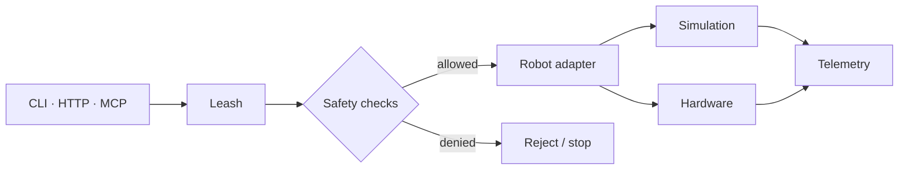

# Leash

> Safe robot control from the CLI, HTTP, and MCP.

Leash is an open-source Rust runtime for controlling robots. Start in simulation, replay recorded runs, or connect real hardware behind explicit safety checks.

Humans, apps, and agents use the same control path. Agents can request motion. Leash decides whether motion is allowed.

## Quick start

```bash
cargo install leash-harness
leash run sim-http
```

Then, in another terminal:

```bash
leash health --url http://127.0.0.1:8000
curl -s http://127.0.0.1:8000/telemetry | jq
```

This runs entirely in simulation. It cannot move physical hardware.

For MCP over stdio:

```bash
leash run sim-mcp
```

For MCP over localhost HTTP:

```bash
leash serve mcp-http --listen 127.0.0.1:9990
leash mcp list-tools
leash mcp call observe
```

## What Leash does

- CLI, HTTP, WebSocket/SSE, and MCP control surfaces
- simulation with no robot required
- deterministic record and replay
- typed telemetry and sensor contracts
- bounded navigation goals, patrols, cancellation, and verified stop
- localization and map provider interfaces
- feature-gated hardware adapters
- CPU and optional CUDA processing for bounded spatial workloads
- one safety path for manual, programmatic, and agent control


```mermaid
flowchart LR
  client["CLI · HTTP · MCP"] --> leash["Leash"]
  leash --> checks{"Safety checks"}
  checks -- allowed --> adapter["Robot adapter"]
  checks -- denied --> stop["Reject / stop"]
  adapter --> sim["Simulation"]
  adapter --> robot["Hardware"]
  sim --> telemetry["Telemetry"]
  robot --> telemetry
```

## Safety

Leash owns the final command sent to the robot.

A planner, ROS 2 node, model, CUDA job, web app, or agent can provide a request or data, but it cannot write to the motors directly.

Physical motion is off by default. Hardware paths require the relevant build feature and runtime opt-in, then pass the normal authorization, approval, sensor freshness, deadman, collision, distance-limit, stop, and E-stop checks.

Simulation and replay never actuate hardware.

See [Physical navigation](docs/PHYSICAL_NAVIGATION.md).

## Real hardware

The current concrete implementation is the [Waveshare UGV stack](implementations/waveshare-ugv/README.md).

Robot-specific device paths, calibration, deployment, rollback, and field evidence live under `implementations/waveshare-ugv/` instead of the reusable Leash core.

ROS 2 can provide mapping, localization, and navigation data. Leash remains the motor owner.

## Navigation

Leash provides a bounded HTTP API for clients that want to submit goals without running their own motor command loop.

| Method | Route | Purpose |
| --- | --- | --- |
| `POST` | `/navigation/goals` | Submit a goal |
| `GET` | `/navigation/status?mission_id=...` | Read goal status |
| `POST` | `/navigation/goals/:mission_id/cancel` | Cancel a goal |
| `POST` | `/motors/stop/verified` | Stop and verify zero output |

Physical goals require an existing pilot lease and remain subject to all normal safety checks.

See [Navigation API](docs/NAVIGATION_API.md).

## Compute

Leash also has an authenticated asynchronous compute API for bounded sensor-processing jobs.

The current `spatial_window` job transforms recent range scans into spatial points in the odometry frame. Small jobs run on CPU. Larger jobs can use CUDA after parity checks prove that the GPU result matches the CPU result. CUDA failures fall back to CPU.

Compute results never authorize motion.

See [Compute API](docs/COMPUTE_API.md).

## Repository

```text
crates/                      Rust workspace crates
src/                         CLI, HTTP, MCP, and harness integration
implementations/             robot-specific implementations and field proof
operator/                    operator-side code and tests
examples/                    simulation, replay, and client examples
docs/                        guides and protocol documentation
schemas/                     generated JSON Schema
scripts/                     smoke tests, packaging, and deployment helpers
specs/leash/                 DotDog source and compiled project graph
.github/workflows/           CI and release automation
```

Key crates:

- `leash-core` — shared contracts and types
- `leash-runtime` — runtime orchestration
- `leash-cuda` — optional CUDA compute
- `leash-gateway` — gateway boundary
- `leash-replay` — replay support
- `leash-ros2` — ROS 2 integration boundary
- `leash-waveshare` — reusable Waveshare adapter code

## Contributing

Leash is MIT licensed. See [CONTRIBUTING.md](CONTRIBUTING.md).

```bash
git clone https://github.com/specdog/leash.git
cd leash
npm ci
cargo build
cargo run -- run sim-http
```

Work on a branch from current `main`. Keep hardware changes feature-gated and test simulation paths without hardware.

Before merge, the full repository check is:

```bash
cargo fmt --check
cargo clippy --workspace --all-targets --all-features -- -D warnings
cargo test --workspace --all-targets --all-features
cargo test -p leash-core --doc
cargo test --no-default-features --features sim,mcp
npm test
cargo run --features mcp --bin leash-schema -- --check
cargo package --workspace --locked
scripts/smoke-all.sh
```

## Coding agents

See [AGENTS.md](AGENTS.md) before changing the repository.

The human-authored project spec lives in `specs/leash/*.dog`. Agents should query the compiled `specs/leash/leash.dag` through DotDog MCP:

```bash
npm ci
npx dotdog serve
```

If the graph and the code disagree, report the mismatch rather than guessing.

## Docs

- [Adapters](docs/ADAPTERS.md)
- [MCP HTTP](docs/MCP_HTTP.md)
- [Sensors](docs/SENSORS.md)
- [Localization](docs/LOCALIZATION.md)
- [Navigation](docs/NAVIGATION.md)
- [Navigation API](docs/NAVIGATION_API.md)
- [Physical navigation](docs/PHYSICAL_NAVIGATION.md)
- [Compute API](docs/COMPUTE_API.md)
- [Replay](docs/OPERATOR_SESSIONS.md)
- [Schemas](docs/SCHEMAS.md)
- [Release](docs/RELEASE.md)

## License

MIT
