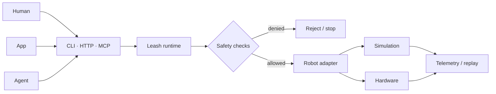

# Leash

> Safe robot control from the CLI, HTTP, and MCP.

Leash is an open-source Rust runtime for controlling robots. Start in simulation, replay recorded runs, or connect real hardware behind explicit safety checks.

Humans, apps, and agents use the same control path. Agents can request motion. Leash decides whether motion is allowed.

## Quick start

```bash
cargo install leash-harness
leash run sim-http
```

Then, in another terminal:

```bash
leash health --url http://127.0.0.1:8000
curl -s http://127.0.0.1:8000/telemetry | jq
```

This runs entirely in simulation. It cannot move physical hardware.

For MCP over stdio:

```bash
leash run sim-mcp
```

For MCP over localhost HTTP:

```bash
leash serve mcp-http --listen 127.0.0.1:9990
leash mcp list-tools
leash mcp call observe
```

Useful discovery commands:

```bash
leash list
leash show-config sim-http
```

## Features

| Area | What is available |
| --- | --- |
| Control | CLI, HTTP, MCP stdio, MCP Streamable HTTP, WebSocket/SSE telemetry |
| Simulation | no-hardware runs, deterministic fixtures, record and replay |
| Agents | persisted sessions, headless runs, browser console, scoped capability calls, supervised recurring tasks |
| Navigation | bounded goals, patrols, status, cancellation, deadlines, verified stop |
| Sensors | typed range-scan, IMU, camera, localization, map, path, and telemetry contracts |
| Compute | authenticated asynchronous jobs, CPU execution, qualified CUDA acceleration, CPU fallback |
| Hardware | feature-gated adapters with a concrete Waveshare UGV implementation |
| ROS 2 | mapping/localization/navigation provider boundary without giving ROS direct motor ownership |
| Safety | authorization, approval, deadman, freshness, collision, distance, Stop, and latching E-stop checks |

## Demo

[Geek on a Leash](talks/geek-on-a-leash/output/geek-on-a-leash.pdf) is the full Leash demo and Rust Tuesdays talk. It walks through the agent-to-motor boundary, the Rust runtime, ROS 2 integration, CUDA processing, and a bounded UGV demo.

The demo package includes:

- [editable deck source](talks/geek-on-a-leash/deck.mjs)
- [PowerPoint](talks/geek-on-a-leash/output/geek-on-a-leash.pptx)
- [source + notes](talks/geek-on-a-leash/README.md)
- [speaker notes](talks/geek-on-a-leash/output/speaker-notes.md)
- [demo preflight](talks/geek-on-a-leash/demo-preflight.mjs)
- [recorded fallback demo](talks/geek-on-a-leash/output/fallback-demo.mp4)

## How it works

Every control surface reaches the same runtime and safety checks before a robot adapter receives a command.


```mermaid
flowchart LR
  human["Human"] --> api
  app["App"] --> api
  agent["Agent"] --> api
  api["CLI · HTTP · MCP"] --> leash["Leash runtime"]
  leash --> checks{"Safety checks"}
  checks -- denied --> stop["Reject / stop"]
  checks -- allowed --> adapter["Robot adapter"]
  adapter --> sim["Simulation"]
  adapter --> robot["Hardware"]
  sim --> telemetry["Telemetry / replay"]
  robot --> telemetry
```

Leash owns the final device command. A planner, ROS 2 node, model, CUDA job, browser, or external agent can provide a request or evidence, but it does not become a second motor writer.

## Agent workflows

Current `main` includes durable agent sessions, a browser console, direct capability calls, and supervised recurring tasks.

```bash
leash agent run "summarize current health" --session demo
leash agent sessions list
leash agent headful --no-open
leash agent capability call health --allow health
```

Agent sessions are persisted so a run can be resumed instead of starting from an empty prompt every time. Capability calls and tasks use explicit allow/deny patterns and still pass through the normal Leash capability and safety checks.

The HTTP runtime also exposes the agent console and agent endpoints used by the CLI and browser UI. The browser capability probe is observe-only; it cannot be used as a shortcut around physical-motion checks.

## Telemetry, recording, and replay

Leash keeps the same typed data model across live operation and replay. Current telemetry can carry robot health, command state, sensors, localization, map data, planner paths, and spatial evidence.

Simulation and replay never actuate physical hardware. Recorded data can be used to reproduce control and sensor behavior without reconnecting a robot.

The runtime supports normal telemetry plus compact telemetry for clients that need scan/localization/path/voxel data without transferring the larger unused surfaces.

Useful docs:

- [Sensors](docs/SENSORS.md)
- [Localization](docs/LOCALIZATION.md)
- [Operator sessions and replay](docs/OPERATOR_SESSIONS.md)
- [Schemas](docs/SCHEMAS.md)

## Navigation

Leash provides bounded goal-level navigation so a client does not need to own a continuous motor refresh loop.

| Method | Route | Purpose |
| --- | --- | --- |
| `POST` | `/navigation/goals` | Submit an idempotent bounded goal |
| `GET` | `/navigation/status?mission_id=...` | Read goal status |
| `POST` | `/navigation/goals/:mission_id/cancel` | Cancel a goal and command zero output |
| `POST` | `/motors/stop/verified` | Stop and verify zero output |

A physical goal does not create or extend its own pilot lease. Physical navigation remains subject to authorization, approval, localization and sensor freshness, collision checks, deadman, distance limits, Stop, and E-stop.

See [Navigation API](docs/NAVIGATION_API.md) and [Physical navigation](docs/PHYSICAL_NAVIGATION.md).

## Compute and CUDA

Leash has an authenticated asynchronous compute API for bounded sensor-processing jobs. Compute is advisory: a compute result does not authorize motion.

The current `spatial_window` workload transforms recent range scans into spatial points in the odometry frame. Small jobs run on CPU. CUDA can be used after CPU-authoritative parity checks qualify the accelerator. If CUDA fails or diverges, Leash falls back to CPU and reports the fallback.

The CUDA workspace includes reproducible kernel artifacts and checked evidence for Jetson Orin NX and desktop NVIDIA development.

See [Compute API](docs/COMPUTE_API.md) and [`crates/leash-cuda`](crates/leash-cuda/README.md).

## Real hardware

The concrete hardware implementation in this repository is the [Waveshare UGV stack](implementations/waveshare-ugv/README.md).

It includes the robot-specific adapter, sensor integration, deployment and rollback tools, calibration workflow, ROS 2 mapping/localization integration, physical-navigation proof tooling, and checked rollout evidence.

Physical motion is off by default. Hardware paths require the relevant build feature and runtime opt-in before normal authorization and safety checks even run.

Robot-specific device paths, calibration, deployment details, and field evidence stay under `implementations/waveshare-ugv/` rather than leaking into reusable core crates.

## ROS 2

ROS 2 is a provider boundary, not the final authority boundary.

Leash can consume mapping, localization, planner, and navigation information from ROS 2 while retaining ownership of the final motor command. The repository includes a native ROS 2 crate plus the concrete Waveshare SLAM/navigation implementation and verification tooling.

See [`crates/leash-ros2`](crates/leash-ros2/README.md), [Localization providers](docs/LOCALIZATION_PROVIDERS.md), and the [Waveshare implementation](implementations/waveshare-ugv/README.md).

## Safety model

The important rule is simple: only Leash writes the final robot command.

Physical paths are fail-closed. Depending on the operation, checks include:

- capability policy and caller authorization
- pilot ownership / lease state
- explicit approval for physical actions
- deadman state
- sensor and provider freshness
- localization quality
- collision clearance
- bounded speed and distance limits
- explicit Stop
- latching E-stop

If a required condition disappears during a physical operation, the runtime cancels the operation and commands zero output.

Simulation and replay do not actuate hardware.

## Rust workspace

Leash is a multi-crate workspace:

- [`leash-core`](crates/leash-core/README.md) — shared domain contracts, control types, frames, units, and safety primitives
- [`leash-runtime`](crates/leash-runtime/README.md) — runtime orchestration, safety lanes, evidence, and supervision
- [`leash-cuda`](crates/leash-cuda/README.md) — bounded CUDA execution, qualification, parity, and fallback
- [`leash-gateway`](crates/leash-gateway/README.md) — typed gateway/service boundary
- [`leash-replay`](crates/leash-replay/README.md) — deterministic replay support
- [`leash-ros2`](crates/leash-ros2/README.md) — ROS 2 provider and native integration boundary
- [`leash-waveshare`](crates/leash-waveshare/README.md) — reusable Waveshare adapter code
- `src/` — top-level CLI, HTTP, MCP, agent, compatibility, and harness integration

## Repository layout

```text
crates/                      reusable Rust workspace crates
src/                         CLI, HTTP, MCP, agent, and harness integration
implementations/             robot-specific implementations and field proof
operator/                    operator-side code and tests
examples/                    simulation, replay, and client examples
talks/                       demos, talks, and presentation artifacts
docs/                        guides and protocol documentation
schemas/                     generated JSON Schema
scripts/                     smoke tests, packaging, proof, and deployment helpers
specs/leash/                 DotDog source and compiled project graph
.github/workflows/           CI, ROS 2, and release automation
```

## Contributing

Leash is MIT licensed. See [CONTRIBUTING.md](CONTRIBUTING.md).

```bash
git clone https://github.com/specdog/leash.git
cd leash
npm ci
cargo build
cargo run -- run sim-http
```

Work on a branch from current `main`. Keep hardware changes feature-gated and use simulation for normal development unless the change specifically requires physical proof.

The full repository check mirrors CI:

```bash
cargo fmt --check
cargo clippy --workspace --all-targets --all-features -- -D warnings
cargo test --workspace --all-targets --all-features
cargo test -p leash-core --doc
cargo test --no-default-features --features sim,mcp
npm test
cargo run --features mcp --bin leash-schema -- --check
cargo package --workspace --locked
scripts/smoke-all.sh
```

## Coding agents

See [AGENTS.md](AGENTS.md) before changing the repository. Reusable verification instructions are under [`.agents/skills/`](.agents/skills/).

The human-authored project spec lives in `specs/leash/*.dog`. Coding agents query the compiled `specs/leash/leash.dag` through DotDog MCP:

```bash
npm ci
npx dotdog serve
```

Current code, tests, schemas, and merged documentation define current behavior. If the graph and implementation disagree, report the mismatch rather than inventing structure.

## Documentation

- [Adapters](docs/ADAPTERS.md)
- [MCP HTTP](docs/MCP_HTTP.md)
- [Sensors](docs/SENSORS.md)
- [Camera](docs/CAMERA.md)
- [Localization](docs/LOCALIZATION.md)
- [Localization providers](docs/LOCALIZATION_PROVIDERS.md)
- [Navigation](docs/NAVIGATION.md)
- [Navigation API](docs/NAVIGATION_API.md)
- [Physical navigation](docs/PHYSICAL_NAVIGATION.md)
- [Compute API](docs/COMPUTE_API.md)
- [Operator sessions and replay](docs/OPERATOR_SESSIONS.md)
- [Schemas](docs/SCHEMAS.md)
- [Source map](docs/SOURCE_MAP.md)
- [Release](docs/RELEASE.md)

## License

MIT
