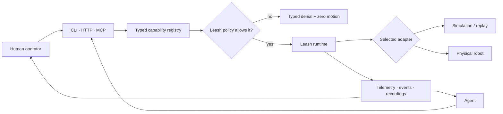
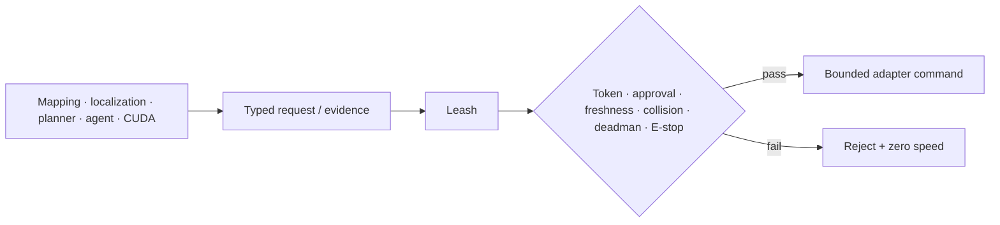

# Leash

> One safety-gated control surface for agents, operators, simulations, and physical robots.

Leash is an open-source Rust robotics runtime. CLI, HTTP, and MCP requests converge on the same typed capability and safety boundary. An AI or operator can request motion; **Leash decides whether motion is allowed**.

Simulation and replay are non-actuating by default. Physical actuation and physical navigation require separate compile/runtime gates plus normal authorization, approval, freshness, deadman, collision, stop, and E-stop checks.

## Current main

The current repository is an active multi-crate workspace, not a crate skeleton.

| Area | Current implementation |
| --- | --- |
| Control surfaces | CLI, HTTP, WebSocket/SSE telemetry, MCP stdio, MCP Streamable HTTP |
| Safe local use | simulation, deterministic replay, record/replay JSONL, generated schemas |
| Agent workflows | persisted sessions, headless or browser runs, permission-scoped capability calls, and supervised recurring tasks |
| Navigation | planner/patrol primitives plus bounded idempotent HTTP goals, status, cancellation, deadlines, and verified stop |
| Compute | authenticated async advisory jobs with bounded temporal-spatial evidence, CPU execution, qualified CUDA acceleration, parity checks, and CPU fallback |
| Hardware | feature-gated Waveshare UGV implementation with calibration/deployment/rollout evidence kept outside reusable core |
| Localization | typed localization/map contracts and provider boundaries; ROS 2 supplies proposals/evidence and never owns motors |
| Safety | capability policy, pilot ownership, approval, deadman, stale-provider checks, collision clearance, soft odometry limits, stop, and latching E-stop |


```mermaid
flowchart LR
  human["Human operator"] --> surface
  agent["Agent"] --> surface
  surface["CLI · HTTP · MCP"] --> registry["Typed capability registry"]
  registry --> policy{"Leash policy allows it?"}
  policy -- no --> denied["Typed denial + zero motion"]
  policy -- yes --> runtime["Leash runtime"]
  runtime --> adapter{"Selected adapter"}
  adapter --> sim["Simulation / replay"]
  adapter --> robot["Physical robot"]
  runtime --> telemetry["Telemetry · events · recordings"]
  telemetry --> human
  telemetry --> agent
```

### Rust workspace

- `crates/leash-core` — reusable contracts and core types
- `crates/leash-runtime` — runtime orchestration
- `crates/leash-cuda` — bounded advisory CUDA compute with CPU parity/fallback
- `crates/leash-gateway` — gateway boundary
- `crates/leash-replay` — replay support
- `crates/leash-ros2` — ROS 2 provider/proposal boundary
- `crates/leash-waveshare` — reusable Waveshare adapter code
- `src/` — top-level CLI/HTTP/MCP harness integration
- `implementations/waveshare-ugv/` — concrete robot deployment, calibration, and field proof

## Try it safely

Install the CLI and start the simulated HTTP stack:

```bash
cargo install leash-harness
leash run sim-http
```

In another terminal:

```bash
leash health --url http://127.0.0.1:8000
curl -s http://127.0.0.1:8000/telemetry | jq
leash agent-send "inspect the battery"
```

Nothing in that path can touch hardware.

Run MCP over stdio:

```bash
leash run sim-mcp
```

Or run the local MCP HTTP endpoint:

```bash
leash serve mcp-http --listen 127.0.0.1:9990
leash mcp list-tools
leash mcp call health
leash mcp call observe
```

Inspect built-in stacks and configuration:

```bash
leash list
leash show-config sim-http
```

## Agent workflows

Current `main` includes durable agent sessions, a browser console, direct
capability calls, and supervised recurring tasks:

```bash
leash agent run "summarize current health" --session demo
leash agent sessions list
leash agent headful --no-open
leash agent capability call health --allow health
```

Model turns support deterministic-test, local HTTP, and OpenAI-compatible HTTP
providers. Agent capability calls and tasks have explicit allow/deny patterns
and still pass through the shared capability registry and safety policy.

## Bounded navigation API

Leash exposes a goal-level HTTP surface for clients that need mission orchestration without owning a motor refresh loop:

| Method | Route | Purpose |
| --- | --- | --- |
| `POST` | `/navigation/goals` | Submit an idempotent bounded planner goal |
| `GET` | `/navigation/status?mission_id=...` | Reconcile planner state |
| `POST` | `/navigation/goals/:mission_id/cancel` | Cancel and command zero output |
| `POST` | `/motors/stop/verified` | Command and confirm zero output |

The caller must already hold a short pilot lease. Goal submission does not create or extend that lease. Current physical goals are low-speed, bounded by deadline, and remain subordinate to all Leash safety checks.

See [`docs/NAVIGATION_API.md`](docs/NAVIGATION_API.md) and [`docs/PHYSICAL_NAVIGATION.md`](docs/PHYSICAL_NAVIGATION.md).

## Advisory compute

The asynchronous compute API accepts authenticated, bounded jobs and returns typed evidence. Compute never receives motor authority.

The current `spatial_window` workload can transform recent range scans into odometry-frame spatial evidence. Small workloads stay on CPU. CUDA is allowed only after CPU-authoritative shadow comparisons qualify the accelerator; a mismatch or CUDA failure falls back to CPU with an explicit receipt.

See [`docs/COMPUTE_API.md`](docs/COMPUTE_API.md).

## Physical robot boundary

Leash owns the final device command boundary. Perception, mapping, localization, planning, ROS 2, CUDA, model providers, and external agents may provide typed evidence or requests; they do not write motors directly.


```mermaid
flowchart LR
  providers["Mapping · localization · planner · agent · CUDA"] --> proposal["Typed request / evidence"]
  proposal --> leash["Leash"]
  leash --> checks{"Token · approval · freshness · collision · deadman · E-stop"}
  checks -- pass --> motors["Bounded adapter command"]
  checks -- fail --> zero["Reject + zero speed"]
```

The current concrete implementation is [`implementations/waveshare-ugv/`](implementations/waveshare-ugv/README.md). Robot identity, device paths, calibration, deployment, rollback, and field proof remain implementation-owned rather than leaking into reusable core.

## Open source: humans

See [`CONTRIBUTING.md`](CONTRIBUTING.md).

Minimal setup:

```bash
git clone https://github.com/specdog/leash.git
cd leash
npm ci
cargo build
cargo run -- run sim-http
```

Work on a branch from current `main`. Before requesting merge, run the repository proof appropriate to the change; the full CI-equivalent set is listed below.

## Open source: coding agents

Start with [`AGENTS.md`](AGENTS.md). The repository also includes reusable verification guidance under [`.agents/skills/`](.agents/skills/).

For project structure, agents query the compiled DotDog graph rather than parsing human `.dog` source:

```bash
npm ci
npx dotdog serve
```

`specs/leash/leash.dag` is the compiled agent graph. Human contributors own `specs/leash/*.dog`. If the graph and current implementation disagree, report the drift instead of silently inventing structure.

## Repository guide

```text
AGENTS.md                    coding-agent entry point
CONTRIBUTING.md              human contributor workflow
crates/                      reusable Rust workspace crates
src/                         top-level harness integration
implementations/             concrete robot implementations and field proof
operator/                    operator-side code/tests
examples/                    simulation, replay, and client fixtures
docs/                        operator, protocol, safety, and extension guides
schemas/                     generated external JSON Schema
scripts/                     smoke, packaging, deployment, and proof helpers
specs/leash/                 DotDog source + compiled DAG
.github/workflows/           CI, ROS 2, and release automation
```

Useful guides:

- [`docs/ADAPTERS.md`](docs/ADAPTERS.md)
- [`docs/MCP_HTTP.md`](docs/MCP_HTTP.md)
- [`docs/SENSORS.md`](docs/SENSORS.md)
- [`docs/LOCALIZATION.md`](docs/LOCALIZATION.md)
- [`docs/LOCALIZATION_PROVIDERS.md`](docs/LOCALIZATION_PROVIDERS.md)
- [`docs/NAVIGATION.md`](docs/NAVIGATION.md)
- [`docs/NAVIGATION_API.md`](docs/NAVIGATION_API.md)
- [`docs/PHYSICAL_NAVIGATION.md`](docs/PHYSICAL_NAVIGATION.md)
- [`docs/COMPUTE_API.md`](docs/COMPUTE_API.md)
- [`docs/OPERATOR_SESSIONS.md`](docs/OPERATOR_SESSIONS.md)
- [`docs/SCHEMAS.md`](docs/SCHEMAS.md)
- [`docs/RELEASE.md`](docs/RELEASE.md)
- [`docs/SOURCE_MAP.md`](docs/SOURCE_MAP.md)

## Verification

The full repository proof mirrors CI:

```bash
cargo fmt --check
cargo clippy --workspace --all-targets --all-features -- -D warnings
cargo test --workspace --all-targets --all-features
cargo test -p leash-core --doc
cargo test --no-default-features --features sim,mcp
npm test
cargo run --features mcp --bin leash-schema -- --check
cargo package --workspace --locked
scripts/smoke-all.sh
```

CI also checks core-only, default, MCP-only, HTTP simulation, hardware-adapter, and all-feature builds.

## License

MIT
