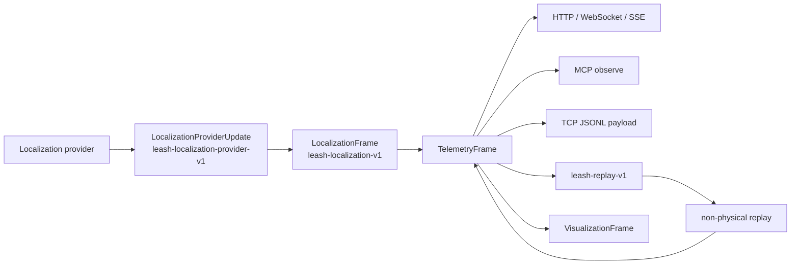

# Localization wire contract

Leash carries localization as a versioned, middleware-neutral message. The
contract describes map identity, a map-frame pose with covariance, and health;
it does not prescribe how a provider computes them.

## Message shape

- `MapIdentity`: stable `map_id`, implementation-defined `map_revision`, and
  coordinate `frame_id`.
- `PoseWithCovariance2d`: `Pose2d` plus a row-major 3x3 covariance for x, y, and
  yaw. Diagonal values are non-negative.
- `LocalizationHealth`: `initializing`, `tracking`, `degraded`, `stale`, `lost`,
  or `unavailable`, plus the last update, message, and optional error.
- `LocalizationFrame`: the version, message timestamp, map identity, optional
  localized pose, and health.
- `LocalizationProviderStatus`: provider state, sequence, map generation,
  freshness, and isolated error state.

Tracking, degraded, and stale frames require a complete map identity and a
timestamp-consistent pose. Lost frames require an error. Invalid versions,
frame mismatches, malformed covariance, and inconsistent timestamps fail the
public validator and are rejected when loaded from replay.

## Cross-surface behavior

`TelemetryFrame.localization`, `TelemetryFrame.map`,
`TelemetryFrame.occupancy_grid`, and `TelemetryFrame.costmap` are the canonical
values. `TelemetryFrame.path` carries a provider planner path without inventing
one while the planner is idle. `TelemetryFrame.voxel_grid` carries sparse voxel
cells with source provenance and an `observed_3d` flag. The Waveshare ROS bridge
subscribes to `/plan`; its current voxel layer is explicitly
`source: projected-occupancy` and `observed_3d: false`, because Pinkie's planar
lidar does not measure obstacle height. A future depth or 3D lidar provider must
publish observed voxels rather than relabeling this projection. HTTP telemetry,
MCP observe, WebSocket/SSE frames, local transports, TCP
JSONL payloads, recording, and replay serialize those same types without field
renaming. The visualization frame carries exact copies plus the same range-scan
and IMU status objects used by telemetry, so a native viewer can render pose,
uncertainty, occupancy/cost maps, and sensor health from one frame.
Provider extension and isolation behavior is documented in
[`LOCALIZATION_PROVIDERS.md`](LOCALIZATION_PROVIDERS.md).

`SensorSnapshot.version` is `leash-sensors-v1`; localization is independently
versioned as `leash-localization-v1`. Outer TCP frames remain
`leash-stream-jsonl-v1`, and recordings remain `leash-replay-v1`.

## Compatibility and replay

New fields are serde-defaulted. Older recordings load with sensor and
localization status `unavailable`, while current recordings retain their source
timestamps and deterministic event order. Readers must reject unknown inner
versions instead of guessing a layout.

- [`sim-mapping.jsonl`](../examples/replay/sim-mapping.jsonl) is an actual
  three-frame recording with matching telemetry/visualization localization.
- [`localization-contract-states.json`](../examples/replay/localization-contract-states.json)
  covers tracking, stale, and lost states.

No frame authorizes physical movement. Provider and physical-navigation
boundaries are separate library concerns.
