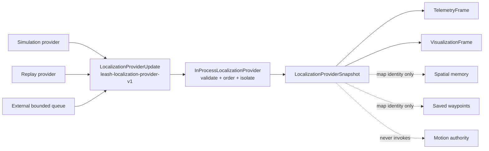

# Localization provider extension guide

Leash accepts localization and map data through one middleware-neutral Rust
contract. A provider publishes an atomic `LocalizationProviderUpdate`; it does
not call drive, planner, patrol, or robot-specific APIs.



## Contract

Every update contains one monotonically increasing `sequence` and an atomic set
of:

- `LocalizationFrame`: map identity/revision, pose, 3x3 covariance, and health;
- `MapMetadata`;
- `OccupancyGridFrame`;
- `CostmapFrame`.

The public validator rejects unsupported versions, pose/map frame mismatches,
map identity mismatches, malformed grids, and grid metadata that diverges from
the canonical map. Updates at or below the accepted sequence are ignored. A map
identity or revision change increments the provider `generation`, so consumers
can distinguish data from replaced maps.

`LocalizationProviderStatus` exposes provider name, connection state, sequence,
generation, source update time, harness receipt time, stale threshold, message,
and error. Missing updates become `stale`; malformed input, explicit failure,
and disconnect are visible without crashing the harness or unrelated modules.

## In-process provider

Implementations that already run in the Leash process can use
`InProcessLocalizationProvider::apply` and read a snapshot through the
`LocalizationProvider` trait:

```rust
use leash_harness::{
    InProcessLocalizationProvider, LocalizationProvider,
    LocalizationProviderUpdate,
};

fn publish(
    provider: &InProcessLocalizationProvider,
    update: LocalizationProviderUpdate,
) -> anyhow::Result<()> {
    provider.apply(update)?;
    let snapshot = provider.snapshot(1_000);
    println!("{:?}", snapshot.status.state);
    Ok(())
}
```

`SimulationLocalizationProvider` and `ReplayLocalizationProvider` are thin
implementations of the same trait. Replay data remains non-physical.

## External stream provider

An implementation process can decode its own transport or middleware and pass
validated Rust updates into a bounded, non-blocking queue:

```rust
use leash_harness::{ExternalLocalizationProvider, LocalizationProviderUpdate};

fn ingest(
    provider: &ExternalLocalizationProvider,
    update: LocalizationProviderUpdate,
) -> anyhow::Result<()> {
    provider.submit(update)?; // try_send: never waits on provider work
    Ok(())
}
```

`Harness::submit_localization_update` exposes that same queue to an embedding
application. Queue saturation and disconnect return explicit errors. Call
`disconnect_localization_provider` or `fail_localization_provider` when an
adapter terminates so telemetry degrades immediately.

An out-of-process local adapter can use the HTTP projection of the same queue.
Set `LEASH_LOCALIZATION_INGRESS_TOKEN_FILE` to a private mode-`0600` token file,
then send the versioned JSON update with `Authorization: Bearer <token>` to
`POST /localization/update`. If the token-file setting is absent, ingress is
disabled with `503`; a missing or wrong token returns `401`. `GET /localization`
reports provider status without enabling ingress. Prefer a private loopback or
robot-local network binding and never put the token in source, command history,
or a URL.

The external adapter owns ROS, SLAM Toolbox, vendor SDKs, device paths,
calibration, transforms, reconnect policy, and robot configuration. None of
those belong in the core provider contract.

## Map-scoped consumers

When spatial memory or a saved waypoint uses the active map frame, Leash stores
the provider's `map_id`, `map_revision`, and `frame_id` alongside it. Older
unscoped files remain readable. A map replacement therefore leaves old data
clearly attributable to its source map instead of silently treating it as
current. List/query responses mark scoped entries and waypoints
`localization-unavailable` when tracking is lost and `map-replaced` when any map
identity field differs. Reloading the same identity clears that dynamic stale
state. New map-frame tags and waypoint writes fail unless localization is
tracking with a pose; `memory_tag_observation` records an observed object at the
current localized pose under the same rule.

Provider data is observational. Supplying a pose, grid, memory entry, or
waypoint does not authorize or issue movement; physical goal execution remains
behind the separate safety gate.
