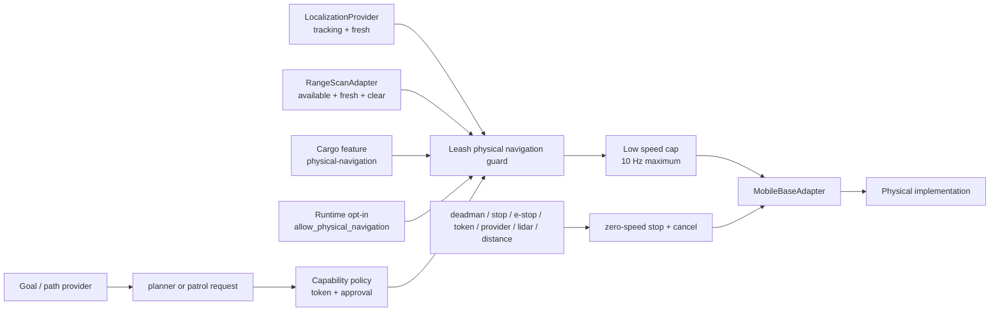

# Physical navigation safety gate

Physical goal and patrol execution is off by default. Enabling ordinary manual
actuation does not enable navigation. A mobile-base implementation must compile
the dedicated feature and set the separate runtime opt-in:

```bash
cargo run --features waveshare-ugv,physical-navigation -- \
  run waveshare-ugv \
  --allow-physical-actuation \
  --allow-physical-navigation \
  --no-untokened-drive \
  --policy-mode require-approval
```

This only opens the library gate. A concrete implementation must still supply
fresh localization/map updates and lidar through the generic provider and
sensor contracts.



## Owned boundaries

Path, localization, mapping, and sensor providers produce data. They never own
actuation. Leash owns policy, the authorization lease, readiness checks, speed
and command-rate limits, cancellation, and the final `MobileBaseAdapter` call.
The implementation owns its device protocol and calibration.

Every physical navigation start requires:

- the `physical-navigation` Cargo feature;
- the `allow_physical_navigation` runtime setting;
- the ordinary physical-actuation gate;
- a mobile-base adapter profile;
- a live pilot token and `approval=true` through the capability policy;
- tracking localization with a current provider receipt;
- a finite 3x3 pose covariance with X/Y standard deviation no greater than
  0.15 m and yaw standard deviation no greater than 10 degrees;
- an available lidar sample no more than 500 ms old;
- no lidar return at or below the minimum clearance;
- no latched e-stop, prior deadman stop, or soft-distance limit.

Physical planner commands are forced to the low speed cap and limited to 10 Hz,
even if a goal or provider requests a higher mode. The authorization lease pins
the active map identity for the entire goal. A physical saved patrol additionally
requires a polygon boundary; every saved waypoint must be inside it and use the
same map/frame. The runtime visits each saved waypoint once and sends zero speed
after the terminal waypoint. Simulation remains deterministic. Replay remains
non-actuating.

The ordinary HTTP server exposes the guarded execution surface used by concrete
implementations:

```text
POST /planner/goal
GET  /planner/status
POST /planner/cancel
POST /patrol/zones/:zone_id/start
GET  /patrol/status
POST /patrol/stop
```

Physical starts on those routes require the same token, approval, compile-time,
runtime, freshness, and covariance gates as MCP. Stop and cancel remain
available without a motion authorization.

## Cancellation contract

An active goal and patrol are cancelled with a zero-speed driver call when any
of these occurs: token expiry/replacement, approval revocation, provider loss or
staleness, lidar loss/staleness/blockage, deadman, soft-distance limit, stop, or
e-stop. A changed map identity or excessive covariance also cancels the goal and
produces zero speed. Recovery is a new policy-gated start; stale authorization
is never reused. E-stop reset remains separately policy-gated.

## Reusable smoke checklist

Use this before adding robot-specific field values:

- [ ] Build without `physical-navigation`; verify runtime opt-in is rejected.
- [ ] Build with the feature but omit runtime opt-in; verify goals and patrols are rejected.
- [ ] Enable both gates but omit token; verify rejection and zero motor command.
- [ ] Supply token but omit approval; verify policy rejection and zero motor command.
- [ ] Test unavailable, stale, lost, malformed, and disconnected localization.
- [ ] Test missing, stale, malformed, disconnected, and blocked lidar.
- [ ] Verify high-speed requests are reduced to the low cap.
- [ ] Verify planner calls cannot exceed 10 Hz at the driver boundary.
- [ ] During active motion, expire/replace the token and revoke approval; verify zero speed.
- [ ] During active motion, trigger deadman, stop, e-stop, and soft-distance limit; verify cancellation.
- [ ] Replace the active map; verify saved waypoint map identity is checked before execution.
- [ ] Run simulation and replay proofs; verify replay never calls physical actuation.
- [ ] Run clippy, all feature-matrix jobs, schemas, `scripts/smoke-all.sh`, and package verification.

Bench and field motion remain implementation tickets. This checklist contains
no robot name, device path, port, calibration value, network address, or private
host detail.

The concrete Pinkie field recorder, replay capture, terminal-stop proof, and
five-run acceptance aggregator live in the linked
[Waveshare UGV navigation implementation](../implementations/waveshare-ugv/navigation/README.md).
