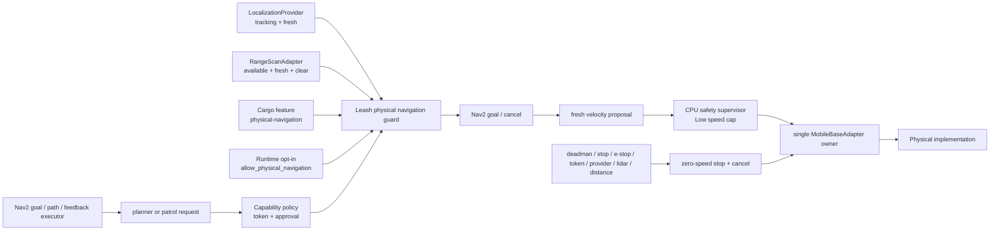

# Physical navigation safety gate

Physical goal and patrol execution is off by default. Enabling ordinary manual
actuation does not enable navigation. A mobile-base implementation must compile
the dedicated feature and set the separate runtime opt-in:

```bash
cargo run --features waveshare-ugv,physical-navigation -- \
  run waveshare-ugv \
  --allow-physical-actuation \
  --allow-physical-navigation \
  --no-untokened-drive \
  --policy-mode require-approval
```

This only opens the library gate. A concrete implementation must still supply
fresh localization/map updates and lidar through the generic provider and
sensor contracts.


```mermaid
flowchart LR
  path["Nav2 goal / path / feedback executor"] --> request["planner or patrol request"]
  localization["LocalizationProvider\ntracking + fresh"] --> guard["Leash physical navigation guard"]
  lidar["RangeScanAdapter\navailable + fresh + clear"] --> guard
  request --> policy["Capability policy\ntoken + approval"]
  compile["Cargo feature\nphysical-navigation"] --> guard
  runtime["Runtime opt-in\nallow_physical_navigation"] --> guard
  policy --> guard
  guard --> nav2["Nav2 goal / cancel"]
  nav2 --> proposal["fresh velocity proposal"]
  proposal --> limiter["CPU safety supervisor\nLow speed cap"]
  limiter --> driver["single MobileBaseAdapter owner"]
  driver --> motors["Physical implementation"]
  stop["deadman / stop / e-stop / token / provider / lidar / distance"] --> zero["zero-speed stop + cancel"]
  zero --> driver
```

## Owned boundaries

Path, localization, mapping, sensor, and Nav2 providers produce data or bounded
proposals. They never own actuation. Leash owns policy, the authorization
lease, readiness checks, speed limits, cancellation, the CPU safety supervisor,
and the final `MobileBaseAdapter` call. The implementation owns its device
protocol and calibration.

Every physical navigation start requires:

- the `physical-navigation` Cargo feature;
- the `allow_physical_navigation` runtime setting;
- the ordinary physical-actuation gate;
- a mobile-base adapter profile;
- a live pilot token and `approval=true` through the capability policy;
- tracking localization with a current provider receipt;
- an available lidar sample no more than 500 ms old;
- no lidar return at or below the minimum clearance;
- no latched e-stop, prior deadman stop, or soft-distance limit.
- an injected Nav2 goal/cancel/path/feedback executor that reports ready.

Physical planner goals are forced to the low speed mode. Nav2 velocity remains
a proposal and must still pass through Leash's CPU safety and motor-owner path.
Without that complete bridge, readiness is explicitly `unsupported` and no
straight-line fallback is attempted. Simulation remains deterministic. Replay
remains non-actuating.

## Cancellation contract

An active goal and patrol are cancelled with a zero-speed driver call when any
of these occurs: token expiry/replacement, approval revocation, provider loss or
staleness, lidar loss/staleness/blockage, deadman, soft-distance limit, stop, or
e-stop. Recovery is a new policy-gated start; stale authorization is never
reused. E-stop reset remains separately policy-gated.

## Reusable smoke checklist

Use this before adding robot-specific field values:

- [ ] Build without `physical-navigation`; verify runtime opt-in is rejected.
- [ ] Build with the feature but omit runtime opt-in; verify goals and patrols are rejected.
- [ ] Enable both gates but omit token; verify rejection and zero motor command.
- [ ] Supply token but omit approval; verify policy rejection and zero motor command.
- [ ] Test unavailable, stale, lost, malformed, and disconnected localization.
- [ ] Test missing, stale, malformed, disconnected, and blocked lidar.
- [ ] Omit the Nav2 executor; verify readiness is `unsupported` and motors remain zero.
- [ ] Verify high-speed requests are reduced to the low mode.
- [ ] Verify Nav2 velocity proposals still pass through CPU safety and the single motor owner.
- [ ] During active motion, expire/replace the token and revoke approval; verify zero speed.
- [ ] During active motion, trigger deadman, stop, e-stop, and soft-distance limit; verify cancellation.
- [ ] Replace the active map; verify the active mission is cancelled and reports `map-changed`.
- [ ] Run simulation and replay proofs; verify replay never calls physical actuation.
- [ ] Run clippy, all feature-matrix jobs, schemas, `scripts/smoke-all.sh`, and package verification.

Bench and field motion remain implementation tickets. This checklist contains
no robot name, device path, port, calibration value, network address, or private
host detail.
