# Docs

This folder is for operator and release documentation that should stay close to the code but not live in the top-level README.

```mermaid
flowchart TB
  docs["docs/"] --> bot["BOT_INSTALL.md\nJetson and Waveshare UGV service install"]
  docs --> release["RELEASE.md\nlocal and CI release gates"]
  docs --> source["SOURCE_MAP.md\nlibrary and UGV implementation boundary"]
  docs --> mcp["MCP_HTTP.md\nstandard and compatibility HTTP paths"]
  docs --> camera["CAMERA.md\ncapture, stream, recovery, and encoder tuning"]
  docs --> navigation["NAVIGATION.md\nsaved waypoints, patrol zones, and motion events"]
  navigation --> physicalNav["PHYSICAL_NAVIGATION.md\nindependent gates and reusable smoke checklist"]
  docs --> adapters["ADAPTERS.md\nRust contracts and second-UGV checklist"]
  docs --> adapterSmoke["ADAPTER_SMOKE_TEMPLATE.md\nreusable pre-fleet proof"]
  docs --> sessions["OPERATOR_SESSIONS.md\nsafe recording and offline GUI replay"]
  docs --> defaultBranch["DEFAULT_BRANCH_RECOVERY.md\ndefault-branch audit and recovery proof"]
  docs --> sensors["SENSORS.md\ngeneric range-scan and IMU contracts"]
  docs --> actionEvidence["ACTION_EVIDENCE.md\npost-safety action interval provenance"]
  docs --> localization["LOCALIZATION.md\nversioned pose, covariance, map, and health wire contract"]
  localization --> providers["LOCALIZATION_PROVIDERS.md\ngeneric provider extension boundary"]

  bot --> service["systemd user service\n~/.config/systemd/user/leash.service"]
  release --> proof["cargo, smoke scripts, package checks"]
  source --> modules["runtime, HTTP, MCP, replay, safety modules"]
```

## Files

- `BOT_INSTALL.md`: how to install Leash on a bot host as a user service.
- `RELEASE.md`: release checklist, feature matrix, bot preflight, and packaging notes.
- `SOURCE_MAP.md`: canonical Leash source map and the library/UGV implementation boundary.
- `MCP_HTTP.md`: MCP Streamable HTTP requests, safety behavior, and legacy REST compatibility.
- `CAMERA.md`: camera ownership, health and recovery routes, capture settings, and Jetson encoder tuning.
- `NAVIGATION.md`: persistent waypoints and patrol zones, sim/replay execution, operator controls, and passive motion events.
- `PHYSICAL_NAVIGATION.md`: compile/runtime gates, policy lease, freshness/cancellation behavior, and generic physical-navigation smoke checklist.
- `ADAPTERS.md`: mobile-base, gimbal, and camera contracts plus the second-UGV implementation checklist.
- `ADAPTER_SMOKE_TEMPLATE.md`: reusable no-hardware, bench, camera, telemetry, soak, and sign-off checklist.
- `OPERATOR_SESSIONS.md`: safe operator event recording and offline GUI timeline replay.
- `DEFAULT_BRANCH_RECOVERY.md`: the audited `main` default-branch recovery, DotDog proof, and repeatable recovery procedure.
- `SENSORS.md`: middleware-neutral planar range-scan and IMU units, frames, validation, and status behavior.
- `ACTION_EVIDENCE.md`: lossless post-safety wheel intervals for replay and world-model supervision.
- `LOCALIZATION.md`: versioned map identity, pose/covariance, health, visualization, and replay behavior.
- `LOCALIZATION_PROVIDERS.md`: in-process, simulation, replay, and non-blocking external localization provider extension guide.
