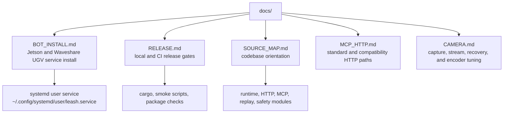

# Docs

This folder is for operator and release documentation that should stay close to the code but not live in the top-level README.

## Files

- `BOT_INSTALL.md`: how to install Leash on a bot host as a user service.
- `RELEASE.md`: release checklist, feature matrix, bot preflight, and packaging notes.
- `SOURCE_MAP.md`: quick map from product surface to implementation files.
- `MCP_HTTP.md`: MCP Streamable HTTP requests, safety behavior, and legacy REST compatibility.
- `CAMERA.md`: camera ownership, health and recovery routes, capture settings, and Jetson encoder tuning.
