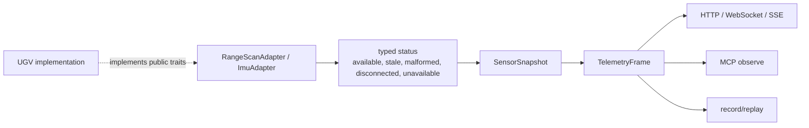

# Sensor contracts

Leash exposes middleware-neutral contracts for a planar range scan and an IMU
sample. These types carry SI units and frame conventions through normal telemetry
without importing a robot SDK, device path, or ROS message dependency.

`SensorSnapshot.version` is `leash-sensors-v1`. Range-scan and IMU status objects
are serialized unchanged through telemetry, HTTP, MCP, streams, recording,
replay, and visualization. See [LOCALIZATION.md](LOCALIZATION.md) for the paired
map/pose/covariance contract and cross-surface compatibility rules.

## Planar range scans

`PlanarRangeScan` is ordered about positive Z in its named frame. Angles use
radians and ranges use meters. `angle_min_rad` is the first sample,
`angle_max_rad` is the last, and `angle_increment_rad` may be positive or
negative. `ranges_m` uses `null`/`None` for an explicitly invalid return;
non-null values must fall inside the declared inclusive range limits.

Validation rejects empty scans, non-finite metadata, a zero angle increment,
angle/count mismatches, spans greater than one turn, invalid ranges, and an
intensity vector whose length differs from the range vector.

## IMU samples

`ImuSample` uses a right-handed body frame: +X forward, +Y left, +Z up. Linear
acceleration uses meters per second squared and angular velocity uses radians per
second. Orientation, when supplied, is an XYZW quaternion. Validation rejects
non-finite fields, corrupt extreme values, and a clearly non-unit quaternion.
The public numeric guard constants are intentionally broader than normal mobile
robot motion; implementation-specific calibration belongs outside the library.

## Status and freshness

`RangeScanStatus` and `ImuStatus` separate transport/device health from sample
data:

| Status | Meaning |
| --- | --- |
| `available` | A current validated sample is present. |
| `stale` | The last validated sample is present but no longer fresh. |
| `malformed` | Input arrived but failed parsing or contract validation. |
| `disconnected` | A previously known source is no longer reachable. |
| `unavailable` | No source is configured or required for this profile. |

Available/stale states require `last_ms` and a timestamp-matching sample.
Malformed/disconnected states require a structured error string. These states
are additive fields on `SensorSnapshot`; older clients and recordings default
them to `unavailable`.

## Implementation boundary

Core code must not contain lidar model names, serial paths, baud rates, fleet
addresses, ROS topics, or robot calibration. A concrete implementation supplies
the public `RangeScanAdapter` and `ImuAdapter` traits and converts failures into
typed status. Missing optional sensors do not prevent unrelated profiles from
starting.

The deterministic fixture at
[`examples/replay/sensor-contract-states.json`](../examples/replay/sensor-contract-states.json)
covers valid, malformed, stale, and disconnected states without hardware.
