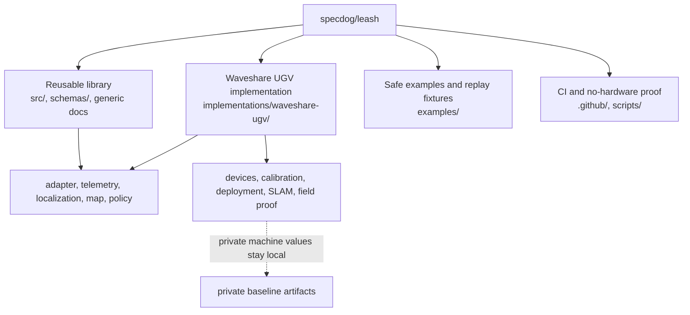

# Source map

This repository is the canonical source for both the reusable Leash library and
its concrete Waveshare UGV implementation. It is not extracted from, mirrored
from, or dependent on an external rover repository.

## Reusable library

- `src/`: runtime, public types/traits, policy, transports, replay, memory, and
  feature-gated adapter boundaries.
- `schemas/`: generated external message contracts.
- `docs/`: generic operator, extension, release, and protocol documentation.
- `scripts/`: hardware-independent smoke and packaging proof.

The library must not require a robot name, fleet address, fixed device path,
vendor calibration, ROS installation, or deployment credential.

## Waveshare UGV implementation

- `implementations/waveshare-ugv/`: concrete deployment, rollback, sensor,
  calibration, localization, and supervised field-proof material.
- `implementations/waveshare-ugv/ros2/`: pinned, read-only ROS 2 Humble bridge,
  EKF/SLAM configuration, map lifecycle, and implementation-owned soak proof.
- `examples/waveshare-ugv/`: minimal runnable physical-adapter example that
  links back to the canonical implementation.

Private host identity, device serials, network values, fingerprints, and full
environment files are captured only in the UGV host's private state directory.

## Safety boundary

The implementation consumes public Leash contracts. Leash remains the sole
owner of motor, camera, and lidar devices; localization or mapping processes may
supply pose, map, covariance, and path data but never bypass Leash actuation,
policy, deadman, stop, or e-stop behavior.
