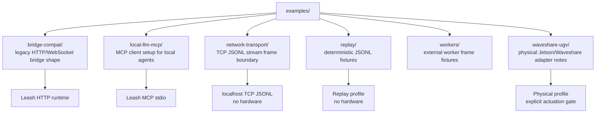

# Examples

This folder contains runnable examples and fixtures for the main operating modes. Examples should stay safe by default unless their README explicitly calls out physical hardware requirements.

## Folders

- `bridge-compat/`: route compatibility for clients that already speak the robot bridge API.
- `local-llm-mcp/`: how to connect an MCP-capable local LLM client.
- `network-transport/`: TCP JSONL stream frame contract for external module processes.
- `replay/`: checked-in replay fixtures for deterministic observe paths and memory demos.
- `workers/`: versioned no-hardware perception input and passive motion-event output fixtures.
- `waveshare-ugv/`: physical adapter notes for the Jetson/Waveshare UGV.
