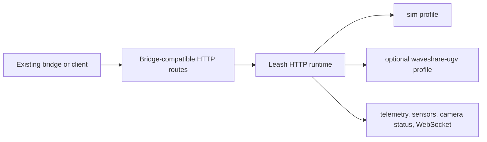

# Bridge Compatibility

Leash can stand in as a simulated or hardware-backed robot runtime for an
existing bridge/client that already speaks the harness HTTP/WebSocket contract.



Run Leash in compatibility mode:

```bash
cargo run --features bridge-compat -- \
  serve http --profile sim --role guard --listen 127.0.0.1:8000
```

Then point the bridge/client at `http://127.0.0.1:8000`.

Compatibility routes currently include:

- `GET /health`
- `GET /capabilities`
- `GET /telemetry`
- `GET /sensors`
- `GET /camera/status`
- `POST /pilot/authorize`
- `POST /pilot/speed-mode`
- `POST /drive`
- `POST /motors/drive`
- `POST /motors/stop`
- `POST /estop`
- `POST /estop/reset`
- `GET /stream`
- `WS /ws/telemetry`
