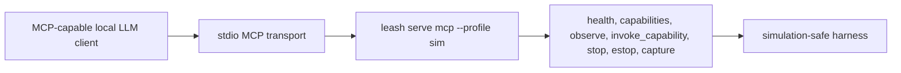

# Local LLM MCP Example

Configure your MCP-capable local LLM client to launch:



Launch command:

```bash
leash serve mcp --profile sim
```

The default sim profile allows safe untokened drive commands. For physical
profiles, keep token/session gating and the physical actuation env gate enabled.

Useful tool calls:

- `health`: confirm runtime and safety state.
- `capabilities`: list supported harness actions.
- `observe`: read current telemetry.
- `invoke_capability`: call `authorize`, `drive`, `speed_mode`, `stop`,
  `estop`, or `estop_reset`.
- `capture`: return deterministic capture metadata.
