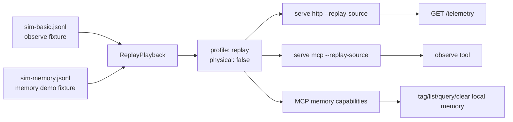

# Replay Example

This folder holds deterministic replay fixtures. Replay lets HTTP and MCP observe paths return stable telemetry without live hardware.



## Files

- `sim-basic.jsonl`: small replay recording used by replay smoke tests and examples.
- `sim-memory.jsonl`: short replay recording for demos that tag and recall locations through MCP while observe output stays deterministic.

## Commands

```bash
leash replay examples/replay/sim-basic.jsonl --speed 10
leash serve http --replay-source examples/replay/sim-basic.jsonl
leash serve mcp --replay-source examples/replay/sim-basic.jsonl
LEASH_STATE_DIR="$(mktemp -d)" leash serve mcp-http --replay-source examples/replay/sim-memory.jsonl
```
