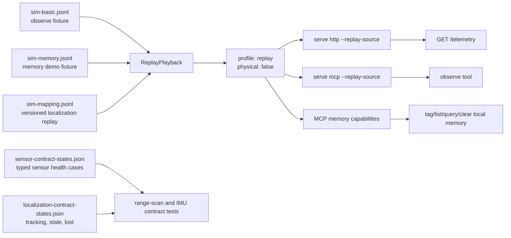

# Replay Example

This folder holds deterministic replay fixtures. Replay lets HTTP and MCP observe paths return stable telemetry without live hardware.



## Files

- `sim-basic.jsonl`: small replay recording used by replay smoke tests and examples.
- `sim-memory.jsonl`: short mapping replay for demos that tag and recall map-scoped locations/objects through MCP while observe output stays deterministic.
- `operator-session.json`: generic browser-operator fixture for offline camera, telemetry, ownership, and joystick timeline replay.
- `sensor-contract-states.json`: deterministic valid, malformed, stale, and disconnected planar-scan/IMU states.
- `sim-mapping.jsonl`: an actual three-frame recording with versioned sensors, map identity, localized pose/covariance, health, and matching visualization data.
- `localization-contract-states.json`: deterministic tracking, stale, and lost localization states.

## Commands

```bash
leash replay examples/replay/sim-basic.jsonl --speed 10
leash serve http --replay-source examples/replay/sim-basic.jsonl
leash serve mcp --replay-source examples/replay/sim-basic.jsonl
leash serve http --replay-source examples/replay/sim-mapping.jsonl
LEASH_STATE_DIR="$(mktemp -d)" leash serve mcp-http --replay-source examples/replay/sim-memory.jsonl
```

The operator fixture uses the separate `leash-operator-session-v1` JSON
contract. Open Leash Operator with `?debug=1`, select **Load**, and choose the
fixture to replay it without a live robot. See
[`docs/OPERATOR_SESSIONS.md`](../../docs/OPERATOR_SESSIONS.md).
