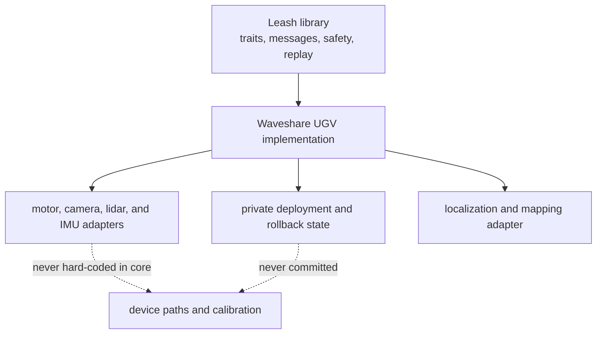

# Implementations

This folder contains concrete robots built on the reusable Leash library. An
implementation may select devices, middleware, calibration, and deployment
policy. It must consume Leash's public contracts and must not move those private
or machine-specific choices into the core library.

## Implementations

- [`waveshare-ugv/`](waveshare-ugv/): the concrete Jetson/Waveshare UGV,
  including deployment, sensor, mapping, and supervised field-proof material.
