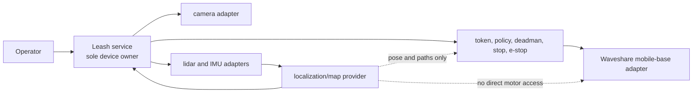
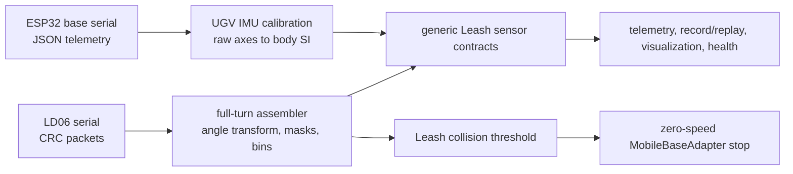

# Waveshare UGV implementation

This is the concrete UGV implementation of the reusable Leash library. Robot
identity, device paths, calibration, ROS configuration, and private deployment
proof belong here or in the private state directory described below. Generic
traits, messages, replay, policy, and safety behavior remain in `src/`.



## Deployment baseline and rollback

The committed tool contains no robot address, credential, fingerprint, serial
number, or fixed device path. Run it locally on the UGV host:

```bash
implementations/waveshare-ugv/deployment-baseline.sh capture \
  --source-revision '<git-sha-and-local-patch-id>' \
  --build-features 'http,mcp,waveshare-ugv,bridge-compat'
```

The command creates a private, mode-`0700` archive under
`~/.local/state/leash/waveshare-ugv-baselines/`. It contains the deployed binary,
service unit, private environment, redacted environment proof, source snapshot,
checksums, API responses, and device-ownership proof. Do not commit that folder.

Prove the recorded source can produce an equivalent binary without taking the
live service or its devices:

```bash
archive='<private-baseline-directory>'
scratch="$(mktemp -d)"
tar -xzf "$archive/source.tar.gz" -C "$scratch"
cd "$scratch"
~/.cargo/bin/cargo build --release --locked --offline \
  --no-default-features \
  --features '<features-from-manifest.txt>'

~/.local/bin/leash list --format json | jq -S . > deployed-stacks.json
target/release/leash list --format json | jq -S . > rebuilt-stacks.json
cmp deployed-stacks.json rebuilt-stacks.json

~/.local/bin/leash graph waveshare-ugv --format json | jq -S . > deployed-graph.json
target/release/leash graph waveshare-ugv --format json | jq -S . > rebuilt-graph.json
cmp deployed-graph.json rebuilt-graph.json
```

This comparison does not start the rebuilt binary, so it cannot claim a device.
Retain the normalized JSON and rebuilt binary checksum in the private proof.

Exercise a captured rollback only with the UGV stationary and stop/e-stop
reachable:

```bash
implementations/waveshare-ugv/deployment-baseline.sh rollback \
  ~/.local/state/leash/waveshare-ugv-baselines/<timestamp> \
  --confirm
```

Rollback sends a zero-speed stop before and after the service restart, restores
the archived binary/unit/environment, verifies health/capabilities/camera/sensors,
and rejects a foreign device owner. It never sends a drive command.

## USB bring-up without committed identity

1. Connect one UGV directly over USB and identify the new point-to-point network
   interface locally.
2. Obtain the current SSH host-key fingerprint out of band. If an address has a
   stale key, use a separate temporary known-hosts file until the physical device
   is confirmed; do not overwrite normal SSH trust silently.
3. Connect with placeholders such as `<user>@<usb-host>`; keep the address,
   fingerprint, hostname, machine ID, and device serials only in the private
   baseline record.
4. Confirm `leash.service` is active, port 8000 has a single Leash listener, and
   no previous harness process is running.
5. Check `/health`, `/capabilities`, `/camera/status`, and `/sensors`, then send
   `POST /stop`. No movement is needed for deployment-baseline proof.

The older runnable adapter example remains at
[`examples/waveshare-ugv/`](../../examples/waveshare-ugv/). This folder is the
canonical home for the complete UGV implementation.

## LD06 lidar and base IMU

The `waveshare-ugv` feature compiles the implementation in this folder into the
Leash binary. Leash remains the sole owner of the motor/base serial device and,
when configured, the LD06-compatible lidar device. No ROS or SLAM process opens
either device.



Configure the implementation in the private service environment. Leaving
`LEASH_UGV_LIDAR_DEVICE` empty disables lidar ownership; IMU ingestion continues
on the already-owned base serial stream.

| Variable | Default | Meaning |
| --- | --- | --- |
| `LEASH_UGV_LIDAR_DEVICE` | empty | Explicit LD06 serial path; no globbing or discovery. |
| `LEASH_UGV_LIDAR_BAUD` | `230400` | LD06 serial baud. |
| `LEASH_UGV_LIDAR_FRAME_ID` | `base_scan` | Output scan frame. |
| `LEASH_UGV_LIDAR_RANGE_MIN_M` / `MAX_M` | `0.02` / `12.0` | Inclusive valid range. |
| `LEASH_UGV_LIDAR_BINS` | `360` | Even bins across one full turn. |
| `LEASH_UGV_LIDAR_MIN_INTENSITY` | `0` | Returns below this device confidence are invalid. |
| `LEASH_UGV_LIDAR_YAW_OFFSET_DEG` | `180` | Sensor-to-body yaw transform. |
| `LEASH_UGV_LIDAR_CLOCKWISE` | `false` | Reverse the raw positive-angle direction. |
| `LEASH_UGV_LIDAR_BODY_MASKS_DEG` | empty | Comma-separated output-frame sectors such as `170:-170`. |
| `LEASH_UGV_LIDAR_STALE_MS` | `500` | Maximum scan age before health becomes stale. |
| `LEASH_UGV_COLLISION_THRESHOLD_M` | `0.25` | Clear, valid return at/below this distance forces stop. |
| `LEASH_UGV_IMU_FRAME_ID` | `base_link` | Right-handed output body frame. |
| `LEASH_UGV_IMU_ACCEL_LSB_PER_G` | `8192` | Base-controller acceleration scale. |
| `LEASH_UGV_IMU_GYRO_DPS_PER_LSB` | `0.0164` | Base-controller gyro scale before conversion to rad/s. |
| `LEASH_UGV_IMU_AXIS_MAP` | `x,y,z` | Signed raw-to-body axes, e.g. `y,-x,z`. |
| `LEASH_UGV_IMU_STALE_MS` | `500` | Maximum IMU age before health becomes stale. |

The default body convention is +X forward, +Y left, +Z up. Acceleration is
converted to m/s² and gyro values to rad/s. The sample timestamp is the Leash
host receipt time because the base JSON frame does not provide an epoch clock;
orientation remains absent rather than publishing an unverified quaternion.
Change scales or signed axes only from measured calibration proof for the
mounted unit.

The LD06 parser accepts the vendor 47-byte `0x54 0x2c` packet, checks CRC-8,
interpolates its 12 angles from packet start/end, applies the configured body
transform and masks, and assembles an evenly binned full revolution. Invalid
range/confidence returns stay explicit `null` values. `scan_rate_hz`, bin count,
validity, source, and freshness are visible on `/sensors` and every normal
telemetry/recording surface.

The scrubbed parser input is
[`examples/waveshare-ugv/sensor-fixture.json`](../../examples/waveshare-ugv/sensor-fixture.json),
and its middleware-neutral replay form is
[`examples/replay/waveshare-ugv-sensors.jsonl`](../../examples/replay/waveshare-ugv-sensors.jsonl).

### Stationary proof

After configuration and with the UGV stationary, run the implementation-owned
ten-minute check locally on the robot:

```bash
implementations/waveshare-ugv/sensor-soak.sh \
  --duration-secs 600 \
  --output ~/.local/state/leash/waveshare-ugv-sensor-proof.json
```

It sends stop before and after the run and never sends drive. It requires one
unchanged service PID, available/fresh lidar and IMU samples, positive scan
rate, stable point count, and bounded RSS spread. Keep the output private; it
contains live process measurements.
