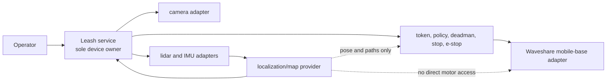
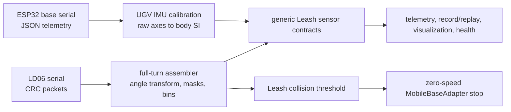
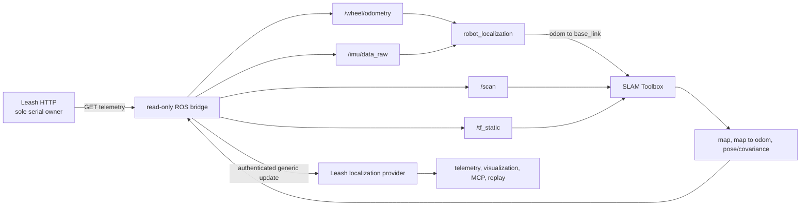

# Waveshare UGV implementation

This is the concrete UGV implementation of the reusable Leash library. Robot
identity, device paths, calibration, ROS configuration, and private deployment
proof belong here or in the private state directory described below. Generic
traits, messages, replay, policy, and safety behavior remain in `src/`.



## Deployment baseline and rollback

The committed tool contains no robot address, credential, fingerprint, serial
number, or fixed device path. Run it locally on the UGV host:

```bash
implementations/waveshare-ugv/deployment-baseline.sh capture \
  --source-revision '<git-sha-and-local-patch-id>' \
  --build-features 'http,mcp,waveshare-ugv,bridge-compat'
```

The command creates a private, mode-`0700` archive under
`~/.local/state/leash/waveshare-ugv-baselines/`. It contains the deployed binary,
service unit, private environment, redacted environment proof, source snapshot,
checksums, API responses, and device-ownership proof. Do not commit that folder.

Prove the recorded source can produce an equivalent binary without taking the
live service or its devices:

```bash
archive='<private-baseline-directory>'
scratch="$(mktemp -d)"
tar -xzf "$archive/source.tar.gz" -C "$scratch"
cd "$scratch"
~/.cargo/bin/cargo build --release --locked --offline \
  --no-default-features \
  --features '<features-from-manifest.txt>'

~/.local/bin/leash list --format json | jq -S . > deployed-stacks.json
target/release/leash list --format json | jq -S . > rebuilt-stacks.json
cmp deployed-stacks.json rebuilt-stacks.json

~/.local/bin/leash graph waveshare-ugv --format json | jq -S . > deployed-graph.json
target/release/leash graph waveshare-ugv --format json | jq -S . > rebuilt-graph.json
cmp deployed-graph.json rebuilt-graph.json
```

This comparison does not start the rebuilt binary, so it cannot claim a device.
Retain the normalized JSON and rebuilt binary checksum in the private proof.

Exercise a captured rollback only with the UGV stationary and stop/e-stop
reachable:

```bash
implementations/waveshare-ugv/deployment-baseline.sh rollback \
  ~/.local/state/leash/waveshare-ugv-baselines/<timestamp> \
  --confirm
```

Rollback sends a zero-speed stop before and after the service restart, restores
the archived binary/unit/environment, verifies health/capabilities/camera/sensors,
and rejects a foreign device owner. It never sends a drive command.

## USB bring-up without committed identity

1. Connect one UGV directly over USB and identify the new point-to-point network
   interface locally.
2. Obtain the current SSH host-key fingerprint out of band. If an address has a
   stale key, use a separate temporary known-hosts file until the physical device
   is confirmed; do not overwrite normal SSH trust silently.
3. Connect with placeholders such as `<user>@<usb-host>`; keep the address,
   fingerprint, hostname, machine ID, and device serials only in the private
   baseline record.
4. Confirm `leash.service` is active, port 8000 has a single Leash listener, and
   no previous harness process is running.
5. Check `/health`, `/capabilities`, `/camera/status`, and `/sensors`, then send
   `POST /stop`. No movement is needed for deployment-baseline proof.

The older runnable adapter example remains at
[`examples/waveshare-ugv/`](../../examples/waveshare-ugv/). This folder is the
canonical home for the complete UGV implementation.

## LD06 lidar and base IMU

The `waveshare-ugv` feature compiles the implementation in this folder into the
Leash binary. Leash remains the sole owner of the motor/base serial device and,
when configured, the LD06-compatible lidar device. No ROS or SLAM process opens
either device.



Configure the implementation in the private service environment. Leaving
`LEASH_UGV_LIDAR_DEVICE` empty disables lidar ownership; IMU ingestion continues
on the already-owned base serial stream.

| Variable | Default | Meaning |
| --- | --- | --- |
| `LEASH_UGV_LIDAR_DEVICE` | empty | Explicit LD06 serial path; no globbing or discovery. |
| `LEASH_UGV_LIDAR_BAUD` | `230400` | LD06 serial baud. |
| `LEASH_UGV_LIDAR_FRAME_ID` | `base_scan` | Output scan frame. |
| `LEASH_UGV_LIDAR_RANGE_MIN_M` / `MAX_M` | `0.02` / `12.0` | Inclusive valid range. |
| `LEASH_UGV_LIDAR_BINS` | `360` | Even bins across one full turn. |
| `LEASH_UGV_LIDAR_MIN_INTENSITY` | `0` | Returns below this device confidence are invalid. |
| `LEASH_UGV_LIDAR_YAW_OFFSET_DEG` | `180` | Sensor-to-body yaw transform. |
| `LEASH_UGV_LIDAR_CLOCKWISE` | `false` | Reverse the raw positive-angle direction. |
| `LEASH_UGV_LIDAR_BODY_MASKS_DEG` | empty | Comma-separated output-frame sectors such as `170:-170`. |
| `LEASH_UGV_LIDAR_STALE_MS` | `500` | Maximum scan age before health becomes stale. |
| `LEASH_UGV_COLLISION_THRESHOLD_M` | `0.25` | Clear, valid return at/below this distance forces stop. |
| `LEASH_UGV_IMU_FRAME_ID` | `base_link` | Right-handed output body frame. |
| `LEASH_UGV_IMU_ACCEL_LSB_PER_G` | `8192` | Base-controller acceleration scale. |
| `LEASH_UGV_IMU_GYRO_DPS_PER_LSB` | `0.0164` | Base-controller gyro scale before conversion to rad/s. |
| `LEASH_UGV_IMU_AXIS_MAP` | `x,y,z` | Signed raw-to-body axes, e.g. `y,-x,z`. |
| `LEASH_UGV_IMU_ACCEL_BIAS_MPS2` | `0,0,0` | Measured body-frame acceleration bias subtracted after scale/axis mapping. |
| `LEASH_UGV_IMU_GYRO_BIAS_RADPS` | `0,0,0` | Measured body-frame angular-velocity bias subtracted after scale/axis mapping. |
| `LEASH_UGV_IMU_STALE_MS` | `500` | Maximum IMU age before health becomes stale. |

The default body convention is +X forward, +Y left, +Z up. Acceleration is
converted to m/s² and gyro values to rad/s. The sample timestamp is the Leash
host receipt time because the base JSON frame does not provide an epoch clock;
orientation remains absent rather than publishing an unverified quaternion.
Change scales or signed axes only from measured calibration proof for the
mounted unit.

The versioned Pinkie profile, measurement sequence, non-actuating capture and
offline acceptance tools are in [`calibration/`](calibration/README.md). The
checked-in profile stays explicitly unmeasured until the issue #166 field gates
and evidence digests have passed.

Only after that calibration and the read-only SLAM proof pass, use the
[`navigation/`](navigation/README.md) workflow for the supervised half-meter,
three-goal, and bounded-patrol evidence. It is separately gated and does not
turn this implementation directory into a reusable navigation library.

The LD06 parser accepts the vendor 47-byte `0x54 0x2c` packet, checks CRC-8,
interpolates its 12 angles from packet start/end, applies the configured body
transform and masks, and assembles an evenly binned full revolution. Invalid
range/confidence returns stay explicit `null` values. `scan_rate_hz`, bin count,
validity, source, and freshness are visible on `/sensors` and every normal
telemetry/recording surface.

The scrubbed parser input is
[`examples/waveshare-ugv/sensor-fixture.json`](../../examples/waveshare-ugv/sensor-fixture.json),
and its middleware-neutral replay form is
[`examples/replay/waveshare-ugv-sensors.jsonl`](../../examples/replay/waveshare-ugv-sensors.jsonl).

### Stationary proof

After configuration and with the UGV stationary, run the implementation-owned
ten-minute check locally on the robot:

```bash
implementations/waveshare-ugv/sensor-soak.sh \
  --duration-secs 600 \
  --output ~/.local/state/leash/waveshare-ugv-sensor-proof.json
```

It sends stop before and after the run and never sends drive. It requires one
unchanged service PID, available/fresh lidar and IMU samples, positive scan
rate, stable point count, and bounded RSS spread. Keep the output private; it
contains live process measurements.

## ROS 2 Humble SLAM adapter

The [`ros2/`](ros2/) directory is an implementation-only adapter. Its container
polls generic Leash telemetry, publishes ROS sensor topics, runs
`robot_localization` and SLAM Toolbox, then submits map/pose/covariance through
the generic localization-provider update. It never opens a device, subscribes
to a velocity-command topic, or calls a Leash movement endpoint.



The image is pinned to the official ARM64-capable Humble ROS base manifest and
pins the installed Humble packages. The current top-level pins are
`robot_localization 3.5.4`, `slam_toolbox 2.6.10`, `tf2 0.25.20`,
`launch_ros 0.19.13`, and ROS interfaces `4.9.1`; the complete Debian build
versions are checked against [`ros2/packages.lock`](ros2/packages.lock) during
every [`ros2/Dockerfile`](ros2/Dockerfile) build.

### Boundary and topics

| Direction | Topic or route | Contract |
| --- | --- | --- |
| Leash to ROS | `/scan` | `sensor_msgs/LaserScan`, capture timestamp and `base_scan` frame preserved. |
| Leash to ROS | `/imu/data_raw` | `sensor_msgs/Imu` in SI units; unknown orientation is explicitly marked unavailable. |
| Leash to ROS | `/wheel/odometry` | Differential wheel pose/twist from Leash distances and measured track/scale. |
| Adapter | `/tf_static` | Measured `base_link` to lidar/camera transforms from private environment. |
| EKF | `/odometry/filtered`, `/tf` | Continuous `odom` to `base_link` estimate. |
| SLAM | `/map`, `/pose`, `/tf` | Occupancy grid, pose/covariance, and `map` to `odom`. |
| ROS to Leash | `POST /localization/update` | Versioned generic provider update; bearer token read from a private file. |

The EKF fuses wheel x/y/yaw, forward velocity, wheel yaw velocity, and IMU yaw
velocity. The bridge publishes conservative wheel pose/twist and IMU covariance
inputs; [`ros2/config/ekf.yaml`](ros2/config/ekf.yaml) documents exactly which
state dimensions are fused. Issue #166 replaces provisional scale, track, pose,
mask, and covariance values with measured calibration.

### Private setup

The host Leash service and the container must read the same random token without
placing it in Git, process arguments, or Compose output:

```bash
install -d -m 700 ~/.config/leash ~/.local/state/leash/waveshare-ugv-slam/maps
openssl rand -hex 32 > ~/.config/leash/localization-token
chmod 600 ~/.config/leash/localization-token
```

Add only this path to the private Leash service environment, then restart Leash
while the UGV is stopped:

```bash
LEASH_LOCALIZATION_INGRESS_TOKEN_FILE=/home/<user>/.config/leash/localization-token
```

Copy [`ros2/.env.example`](ros2/.env.example) to a private file outside the
repository. Set the token/state paths and explicit provisional transform/track
values. Provisional values are for stationary read-only bring-up only; do not
claim calibration from them. Ensure UID 1000 can write the private map-state
directory. Starting the system Docker daemon may require the local operator's
sudo authorization. The lifecycle and soak tools require
`timedatectl show -p NTPSynchronized --value` to report `yes` because external
viewers and freshness gates cannot safely consume a bad clock. On an isolated
UGV where NTP is unavailable, they instead accept a trusted operator epoch only
when the UGV clock is within five seconds. Generate that epoch on the trusted
operator machine immediately before the remote command; generating it on the
UGV would not prove anything.

### Build and lifecycle

Run these commands on the UGV host. Every lifecycle command sends Leash stop
before and after it, and none sends drive:

```bash
export LEASH_ROS_ENV_FILE=~/.config/leash/waveshare-ros.env
implementations/waveshare-ugv/ros2/slam-stack.sh build
implementations/waveshare-ugv/ros2/slam-stack.sh start
implementations/waveshare-ugv/ros2/slam-stack.sh status
implementations/waveshare-ugv/ros2/slam-stack.sh restart
implementations/waveshare-ugv/ros2/slam-stack.sh stop
```

For an offline UGV whose clock has already been corrected, invoke `start` from
the trusted operator machine like this (the local shell expands the epoch):

```bash
trusted_epoch=$(date +%s)
ssh <ugv-host> "~/leash-current/implementations/waveshare-ugv/ros2/slam-stack.sh \
  --env-file ~/.config/leash/waveshare-ros.env \
  --clock-reference-epoch $trusted_epoch start"
```

`status` requires the bridge, EKF, and SLAM nodes; lists only the expected
sensor/map/TF topics; and shows Leash provider state. If the bridge or SLAM
container stops, Leash's generic provider becomes stale and physical navigation
rejects execution. Restart the container, require provider state `tracking`, and
send stop before any later supervised work.

### Save and load maps

Names are restricted to short filename-safe values. Outputs stay in the private
map-state bind mount:

```bash
implementations/waveshare-ugv/ros2/slam-stack.sh save first-room
implementations/waveshare-ugv/ros2/slam-stack.sh load first-room
```

`save` writes both the occupancy-map output and serialized pose graph. `load`
sends stop, calls SLAM Toolbox deserialization with a zero initial pose, and
sends stop again. After load, verify map identity, provider tracking, covariance,
and the current pose before allowing any later navigation ticket.

### Thirty-minute read-only proof

With the UGV stationary and the container already healthy:

```bash
implementations/waveshare-ugv/ros2/ros-soak.sh \
  --env-file ~/.config/leash/waveshare-ros.env \
  --duration-secs 1800 \
  --output ~/.local/state/leash/waveshare-ugv-ros-soak.json
```

If NTP is unavailable, run the soak remotely from the trusted operator machine
in the same way and add `--clock-reference-epoch $trusted_epoch`.

The proof requires one unchanged Leash service PID and container, no restart or
OOM event, fresh lidar/IMU, tracking localization after warmup, and recorded
container CPU/RSS and the clock-proof mode/skew. The robot is stopped before and
after. Keep the JSON private; attach only scrubbed totals to the ticket or pull
request.

Run the no-hardware contract gate anywhere with:

```bash
implementations/waveshare-ugv/ros2/verify.sh
```

The later supervised motion gate and evidence aggregator are documented in the
[physical-navigation implementation guide](navigation/README.md).
