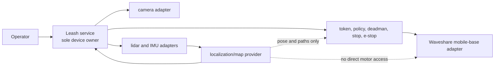

# Waveshare UGV implementation

This is the concrete UGV implementation of the reusable Leash library. Robot
identity, device paths, calibration, ROS configuration, and private deployment
proof belong here or in the private state directory described below. Generic
traits, messages, replay, policy, and safety behavior remain in `src/`.



## Deployment baseline and rollback

The committed tool contains no robot address, credential, fingerprint, serial
number, or fixed device path. Run it locally on the UGV host:

```bash
implementations/waveshare-ugv/deployment-baseline.sh capture \
  --source-revision '<git-sha-and-local-patch-id>' \
  --build-features 'http,mcp,waveshare-ugv,bridge-compat'
```

The command creates a private, mode-`0700` archive under
`~/.local/state/leash/waveshare-ugv-baselines/`. It contains the deployed binary,
service unit, private environment, redacted environment proof, source snapshot,
checksums, API responses, and device-ownership proof. Do not commit that folder.

Prove the recorded source can produce an equivalent binary without taking the
live service or its devices:

```bash
archive='<private-baseline-directory>'
scratch="$(mktemp -d)"
tar -xzf "$archive/source.tar.gz" -C "$scratch"
cd "$scratch"
~/.cargo/bin/cargo build --release --locked --offline \
  --no-default-features \
  --features '<features-from-manifest.txt>'

~/.local/bin/leash list --format json | jq -S . > deployed-stacks.json
target/release/leash list --format json | jq -S . > rebuilt-stacks.json
cmp deployed-stacks.json rebuilt-stacks.json

~/.local/bin/leash graph waveshare-ugv --format json | jq -S . > deployed-graph.json
target/release/leash graph waveshare-ugv --format json | jq -S . > rebuilt-graph.json
cmp deployed-graph.json rebuilt-graph.json
```

This comparison does not start the rebuilt binary, so it cannot claim a device.
Retain the normalized JSON and rebuilt binary checksum in the private proof.

Exercise a captured rollback only with the UGV stationary and stop/e-stop
reachable:

```bash
implementations/waveshare-ugv/deployment-baseline.sh rollback \
  ~/.local/state/leash/waveshare-ugv-baselines/<timestamp> \
  --confirm
```

Rollback sends a zero-speed stop before and after the service restart, restores
the archived binary/unit/environment, verifies health/capabilities/camera/sensors,
and rejects a foreign device owner. It never sends a drive command.

## USB bring-up without committed identity

1. Connect one UGV directly over USB and identify the new point-to-point network
   interface locally.
2. Obtain the current SSH host-key fingerprint out of band. If an address has a
   stale key, use a separate temporary known-hosts file until the physical device
   is confirmed; do not overwrite normal SSH trust silently.
3. Connect with placeholders such as `<user>@<usb-host>`; keep the address,
   fingerprint, hostname, machine ID, and device serials only in the private
   baseline record.
4. Confirm `leash.service` is active, port 8000 has a single Leash listener, and
   no previous harness process is running.
5. Check `/health`, `/capabilities`, `/camera/status`, and `/sensors`, then send
   `POST /stop`. No movement is needed for deployment-baseline proof.

The older runnable adapter example remains at
[`examples/waveshare-ugv/`](../../examples/waveshare-ugv/). This folder is the
canonical home for the complete UGV implementation.
