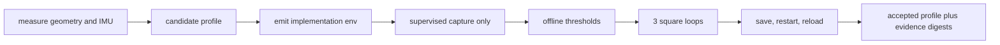

# Pinkie calibration and loop-closure proof

This directory is the concrete Waveshare UGV implementation for Leash issue
#166. Nothing here belongs to the reusable Leash library, and none of the tools
issues a drive, motor, or velocity command. The checked-in profile is deliberately
`unmeasured`; provisional numbers must never be presented as calibration.



## Safety gate

Before any motion capture, an on-site operator must confirm all of the following:

- Pinkie is the physically identified USB target and its SSH host identity is trusted.
- The floor is clear, level, non-public, and large enough for the marked path.
- A spotter is present at the robot with the E-stop reachable.
- Wheels, lidar, and camera are mechanically secure; battery and health are good.
- Leash is the sole base/lidar device owner and the ROS container has no devices.
- A stop command has been observed; no patrol or autonomous goal is active.

`capture.sh` requires `--operator-confirmed` for every motion phase. That flag is
an audit assertion, not a substitute for the physical check. The recorder sends
stop at entry, exit, interruption, and failure. The operator drives with the
existing supervised Leash controls; the recorder has no actuation path.

## 1. Create a candidate

Copy `pinkie-v1.json`, keep the generic profile name, and measure from the
`base_link` origin (+X forward, +Y left, +Z up):

1. Measure effective tire contact-center spacing for `track_width_m`.
2. Start `distance_scale` at the documented encoder unit conversion, then refine
   it only from the taped one-meter run.
3. Measure lidar and camera X/Y/Z offsets and yaw relative to `base_link`.
4. Confirm lidar angular direction/yaw using a single target at known front,
   left, and rear positions. Add body masks only for angles physically occupied
   by Pinkie; wraparound syntax such as `170:-170` is allowed.
5. Confirm IMU signed axes by tilting one body axis at a time. Start biases at
   zero. Record scale sources in the issue, not private device identifiers.
6. Set `status` to `candidate`, add the measurement time, and leave evidence
   digests empty until the accepted runs exist.

Validate values and emit only the calibration assignments:

```bash
python3 implementations/waveshare-ugv/calibration/profile.py \
  implementations/waveshare-ugv/calibration/pinkie-v1.json validate --require-values
python3 implementations/waveshare-ugv/calibration/profile.py \
  implementations/waveshare-ugv/calibration/pinkie-v1.json emit-env --target leash
python3 implementations/waveshare-ugv/calibration/profile.py \
  implementations/waveshare-ugv/calibration/pinkie-v1.json emit-env --target ros
```

Candidate values may be placed only in Pinkie's private service/Compose env for
supervised calibration. `emit-env` never emits device paths, tokens, addresses,
or map-state paths. The stable calibration digest covers the measured values,
not mutable status/evidence metadata, so promotion from candidate to accepted
does not invalidate captures.

## 2. Stationary capture and IMU residuals

Run for at least 60 seconds after localization is tracking:

```bash
implementations/waveshare-ugv/calibration/capture.sh \
  --phase stationary \
  --profile implementations/waveshare-ugv/calibration/pinkie-v1.json \
  --env-file ~/.config/leash/waveshare-ros.env \
  --duration-secs 60 \
  --output ~/.local/state/leash/calibration/stationary.jsonl \
  --replay-output ~/.local/state/leash/calibration/stationary-replay.jsonl

python3 implementations/waveshare-ugv/calibration/analyze.py \
  --profile implementations/waveshare-ugv/calibration/pinkie-v1.json \
  ~/.local/state/leash/calibration/stationary.jsonl
```

The analyzer requires drift at or below 0.05 m and 2 degrees. It records the
residual mean gyro vector and acceleration vector/norm. For a level stationary
robot, refine gyro bias by adding the residual gyro to the current bias; refine
acceleration bias by adding the residual from the expected body vector
`[0, 0, 9.80665]`. Re-deploy and repeat instead of editing evidence.

The raw-scan check proves configured mask sectors contain only invalid returns.
It does not prove the occupancy map looks clean; inspect the native map viewer
and attach a scrubbed image showing no persistent robot-body artifact.

## 3. Supervised distance, turn, and loop captures

Generate the trusted epoch on the operator machine if Pinkie has no NTP. The
examples omit it when NTP is synchronized; otherwise add
`--clock-reference-epoch "$trusted_epoch"` to each remote invocation.

Mark a chassis reference point and a measured one-meter centerline. Capture
while the on-site operator performs one slow straight pass:

```bash
implementations/waveshare-ugv/calibration/capture.sh \
  --phase straight --operator-confirmed --expected-distance-m 1.0 \
  --profile implementations/waveshare-ugv/calibration/pinkie-v1.json \
  --env-file ~/.config/leash/waveshare-ros.env \
  --output ~/.local/state/leash/calibration/straight.jsonl \
  --replay-output ~/.local/state/leash/calibration/straight-replay.jsonl
```

The analysis reports measured wheel/localized distances, both 10% acceptance
checks, and a candidate wheel scale. Next mark heading on the floor and perform
one slow full in-place rotation:

```bash
implementations/waveshare-ugv/calibration/capture.sh \
  --phase turn --operator-confirmed --expected-turn-deg 360 \
  --profile implementations/waveshare-ugv/calibration/pinkie-v1.json \
  --env-file ~/.config/leash/waveshare-ros.env \
  --output ~/.local/state/leash/calibration/turn.jsonl \
  --replay-output ~/.local/state/leash/calibration/turn-replay.jsonl
```

The analyzer unwraps localized yaw, derives wheel yaw, requires both within 10
degrees, and reports a candidate effective track width. Apply one candidate
change at a time and repeat stationary/straight/turn before square evidence.

Mark a one-meter square. Capture three consecutive, separately indexed loops:

```bash
for run in 1 2 3; do
  implementations/waveshare-ugv/calibration/capture.sh \
    --phase square --run-index "$run" --expected-side-m 1.0 --operator-confirmed \
    --profile implementations/waveshare-ugv/calibration/pinkie-v1.json \
    --env-file ~/.config/leash/waveshare-ros.env \
    --output "$HOME/.local/state/leash/calibration/square-$run.jsonl" \
    --replay-output "$HOME/.local/state/leash/calibration/square-$run-replay.jsonl"
done

python3 implementations/waveshare-ugv/calibration/analyze.py \
  --profile implementations/waveshare-ugv/calibration/pinkie-v1.json \
  --require-complete-series \
  "$HOME"/.local/state/leash/calibration/square-{1,2,3}.jsonl
```

Every loop must close within 0.25 m and 15 degrees. Captures contain only
scrubbed health, sensor, localization/covariance, resource, motion/stop, and
container data. They omit tokens, addresses, serials, camera URLs, and raw base
frames. Keep full captures private; attach scrubbed analysis totals and hashes.

Each capture also records the generic live telemetry stream as a normalized,
non-physical `leash-replay-v1` companion with session ownership, worker specs,
raw base payloads, camera URLs, process IDs, and physical gates removed. Prove
the accepted map/localization behavior offline with the normal Leash tools:

```bash
leash replay ~/.local/state/leash/calibration/square-1-replay.jsonl --speed 20
leash serve http --replay-source ~/.local/state/leash/calibration/square-1-replay.jsonl
```

## 4. Save and reload

With the robot stationary and an accepted loop-closing candidate:

```bash
implementations/waveshare-ugv/calibration/map-reload-proof.sh \
  --profile implementations/waveshare-ugv/calibration/pinkie-v1.json \
  --env-file ~/.config/leash/waveshare-ros.env \
  --map-name accepted-room \
  --output ~/.local/state/leash/calibration/map-reload.json
```

This requires all four occupancy/pose-graph files, restarts only the read-only
container, reloads the graph, waits for tracking/covariance, verifies map
identity and the unchanged Leash PID, and leaves motors stopped.

Finally add the SHA-256 digests of accepted private capture/analysis/reload
artifacts to the profile, set `status` to `accepted`, rerun validation, and check
in only the profile plus scrubbed summaries. No autonomous patrol is enabled by
this procedure.

Run the no-hardware gate with:

```bash
implementations/waveshare-ugv/calibration/verify.sh
```
