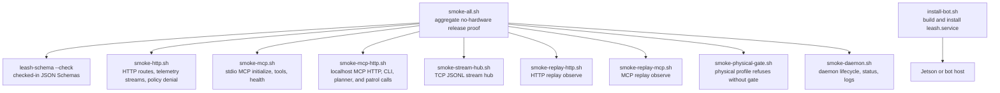

# Scripts

This folder contains shell smoke tests and the bot installer. Scripts are intended to be run from the repository root.

## Files

- `install-bot.sh`: builds a Leash binary and installs a user `systemd` service plus env file on a bot host.
- `smoke-all.sh`: aggregate no-hardware release proof; CI runs this and checks generated schemas.
- `smoke-http.sh`: HTTP, WebSocket/SSE, visualization frame, map/costmap contracts, external clients, agent input, capture, drive, and policy checks.
- `smoke-mcp.sh`: stdio MCP initialization and tool calls.
- `smoke-mcp-http.sh`: localhost MCP HTTP routes, `leash mcp` CLI calls, sim planner set/status calls, and sim patrol start/status/stop calls.
- `smoke-stream-hub.sh`: starts the localhost TCP JSONL stream hub, sends valid frames, and proves an invalid peer does not kill the listener.
- `smoke-replay-http.sh`: replay mode over HTTP.
- `smoke-replay-mcp.sh`: replay mode over MCP.
- `smoke-physical-gate.sh`: proves physical startup fails without explicit actuation.
- `smoke-daemon.sh`: daemon start/status/log/restart/stop path.
