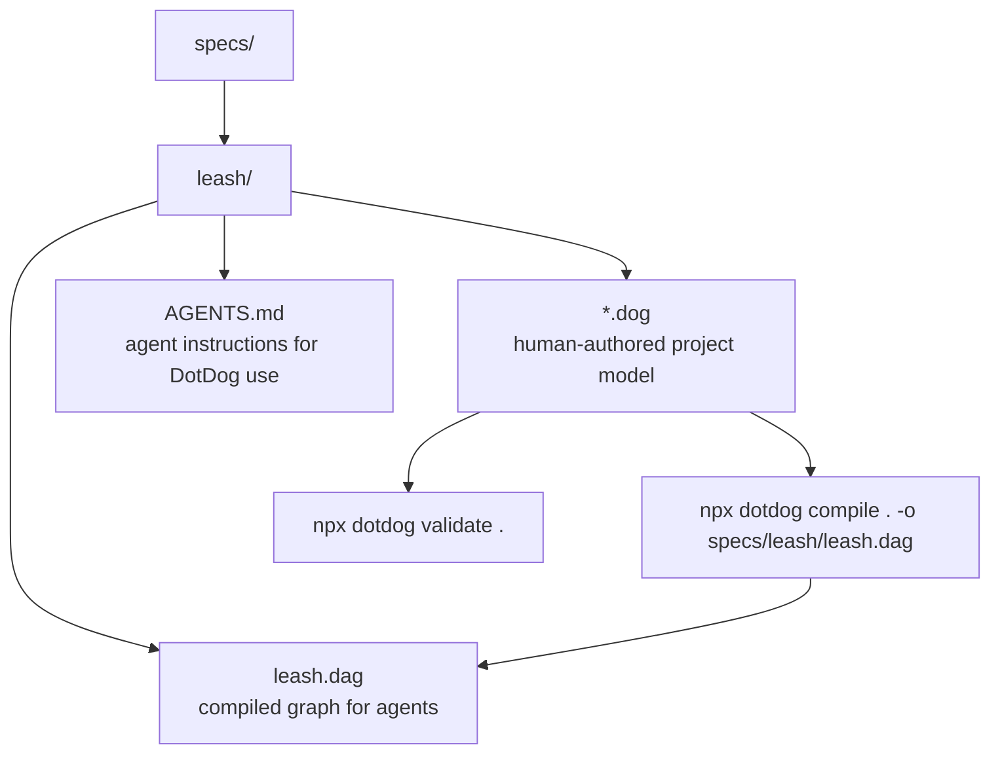

# Specs

This folder contains DotDog planning/spec artifacts. The human-authored `.dog` files live under `specs/leash`; the compiled `.dag` is the agent-readable graph.

## Folders

- `leash/`: the DotDog project for this repo.

Run DotDog commands from the repository root so project discovery sees `specs/leash`.
