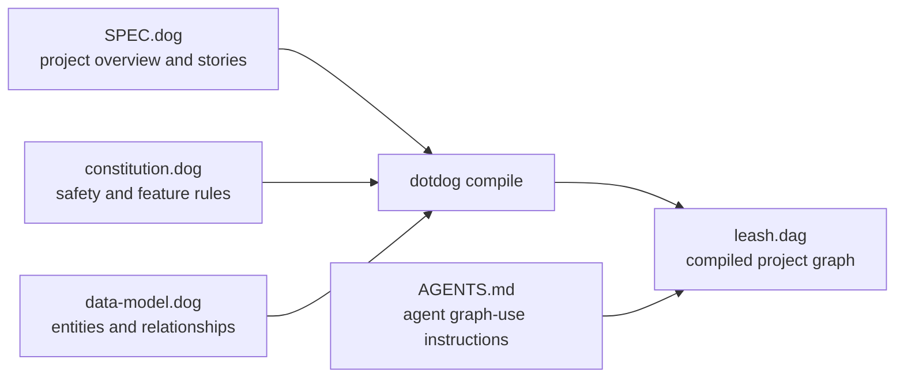

# Leash DotDog Spec

This folder is the DotDog project for Leash. Treat `.dog` files as the human-editable source and `leash.dag` as the compiled graph that agents query.



## Files

- `SPEC.dog`: project overview, stories, and feature direction.
- `constitution.dog`: safety constraints, physical-actuation rules, and release expectations.
- `data-model.dog`: entity and relationship model.
- `leash.dag`: compiled graph output used by agents.
- `AGENTS.md`: guidance for agents working with this DotDog project.

## Commands

From the repository root:

```bash
npx dotdog validate .
npx dotdog compile . -o specs/leash/leash.dag
```
