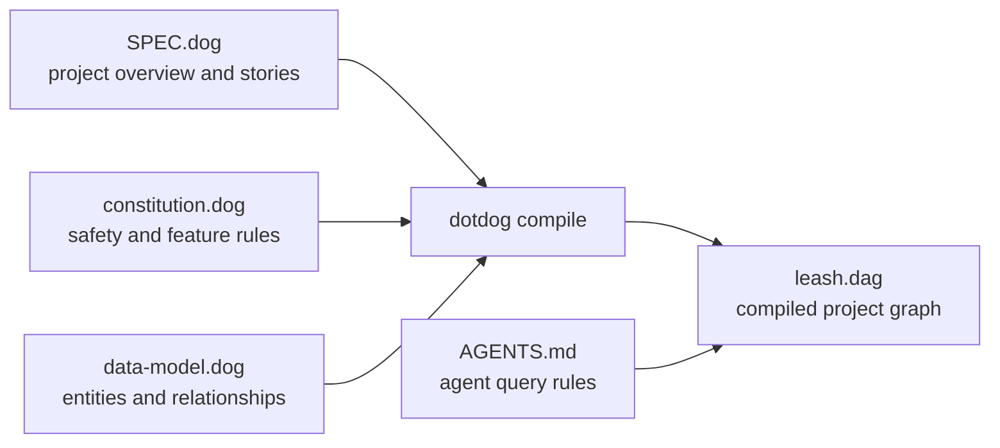

# Leash DotDog Spec

This folder contains the DotDog project graph for Leash. Human contributors edit `.dog` source; agents query the compiled `leash.dag`.


```mermaid
flowchart LR
  spec["SPEC.dog\nproject overview and stories"] --> compile["dotdog compile"]
  constitution["constitution.dog\nsafety and feature rules"] --> compile
  model["data-model.dog\nentities and relationships"] --> compile
  compile --> dag["leash.dag\ncompiled project graph"]
  agents["AGENTS.md\nagent query rules"] --> dag
```

## Files

- `SPEC.dog`: human-authored project overview, interfaces, and stories.
- `constitution.dog`: human-authored safety constraints and release rules.
- `data-model.dog`: human-authored entities and relationships.
- `leash.dag`: compiled graph queried by agents.
- `AGENTS.md`: DotDog-specific instructions for coding agents.

The repository is now an active multi-crate Rust workspace. Runtime implementation facts live in current code/tests on `main`; the DAG describes intended project structure. If they drift, report the discrepancy and update the human source plus compiled graph together.

## Human spec workflow

From the repository root:

```bash
npm ci
npx dotdog validate .
npx dotdog compile . -o /tmp/leash.dag
cmp /tmp/leash.dag specs/leash/leash.dag
npx dotdog analyze .
```

If an intentional spec change changes the compiled output, regenerate `specs/leash/leash.dag` and commit it in the same PR.

## Agent workflow

Agents should not read or edit `.dog` directly. Start DotDog MCP and query the compiled graph:

```bash
npm ci
npx dotdog serve
```

Then use the DotDog MCP tools for entities, traversal, search, schema, summaries, and project discovery. See `AGENTS.md` here and the repository-root `AGENTS.md`.
