# Source

This folder is the reusable Rust library for Leash. It owns the harness runtime, safety registry, config resolution, transports, replay, and optional HTTP/MCP surfaces.

```mermaid
flowchart TB
  lib["lib.rs\npublic crate exports"] --> runtime["runtime.rs\nHarness, drivers, telemetry loop"]
  lib --> capability["capability.rs\nCapabilityRegistry and safety classes"]
  lib --> config["config.rs\nprofiles, env, config precedence"]
  lib --> module["module.rs\nmodule graph and lifecycle"]
  lib --> stack["stack.rs\nbuilt-in runnable stacks"]
  lib --> http["http.rs\nHTTP, SSE, WebSocket routes"]
  lib --> mcp["mcp.rs\nMCP tools and transport"]
  lib --> replay["replay.rs\nrecord/playback JSONL"]
  lib --> daemon["daemon.rs\nbackground runs and logs"]
  lib --> transport["transport.rs\nmemory and local-pubsub streams"]
  lib --> types["types.rs\nshared API structs"]
  lib --> accelerator["accelerator.rs\nCPU/CUDA probe model"]
  lib --> agent["agent.rs\nagent model provider glue"]
  lib --> processing["stream_processing.rs\nbackpressure and filtering helpers"]
  cli["bin/leash.rs\nCLI binary"] --> lib
```

## Files

- `accelerator.rs`: accelerator probe and selection status.
- `agent.rs`: deterministic/local/OpenAI-compatible agent completion adapter.
- `capability.rs`: capability descriptors, safety classes, policy decisions, and invocation.
- `config.rs`: defaults, env/config/CLI precedence, profiles, and redaction.
- `daemon.rs`: daemon registry, process lifecycle, and structured log tailing.
- `http.rs`: HTTP API, SSE/WebSocket telemetry, agent message routes, MCP HTTP routes.
- `lib.rs`: public module declarations and re-exports.
- `mcp.rs`: MCP stdio server, tool schemas, and tool handlers.
- `module.rs`: module graph, states, health, dependencies, and graph export.
- `replay.rs`: replay recording format and playback timing.
- `runtime.rs`: `Harness`, command state, drivers, telemetry, capture, estop, deadman.
- `stack.rs`: built-in stack catalog such as `sim-http`, `sim-mcp`, and `waveshare-ugv-http`.
- `stream_processing.rs`: generic latest-value, rate-limit, quality, and timestamp pairing helpers.
- `transport.rs`: stream transport interface plus memory and local pubsub implementations.
- `types.rs`: serialized HTTP/MCP/replay/API payload types.
- `bin/`: CLI entrypoint crate target.
