# Source

This folder is the reusable Rust library for Leash. It owns the harness runtime, safety registry, config resolution, transports, replay, and optional HTTP/MCP surfaces.

```mermaid
flowchart TB
  lib["lib.rs\npublic crate exports"] --> runtime["runtime.rs\nHarness, drivers, telemetry loop"]
  lib --> capability["capability.rs\nCapabilityRegistry and safety classes"]
  lib --> config["config.rs\nprofiles, env, config precedence"]
  lib --> module["module.rs\nmodule graph and lifecycle"]
  lib --> memory["memory.rs\nfile-backed spatial memory"]
  lib --> stack["stack.rs\nbuilt-in runnable stacks"]
  lib --> http["http.rs\nHTTP, SSE, WebSocket routes"]
  lib --> mcp["mcp.rs\nMCP tools and transport"]
  lib --> mcpbridge["mcp_bridge.rs\nremote bot stdio bridge"]
  lib --> replay["replay.rs\nrecord/playback JSONL"]
  lib --> daemon["daemon.rs\nbackground runs and logs"]
  lib --> transport["transport.rs\nmemory and local-pubsub streams"]
  lib --> worker["worker.rs\nexternal worker supervision"]
  lib --> types["types.rs\nshared API and sensor structs"]
  lib --> adapter["adapter.rs\nmobile-base, camera, range-scan, and IMU traits"]
  lib --> accelerator["accelerator.rs\nCPU/CUDA probe model"]
  lib --> agent["agent.rs\nagent model provider glue"]
  lib --> agentruntime["agent_runtime.rs\nsessions, permissions, scheduled tasks"]
  lib --> processing["stream_processing.rs\nbackpressure and filtering helpers"]
  cli["bin/leash.rs\nCLI binary"] --> lib
```

## Files

- `accelerator.rs`: accelerator probe and selection status.
- `agent.rs`: deterministic/local/OpenAI-compatible agent completion adapter.
- `agent_runtime.rs`: persistent agent sessions, headless run results, scoped capability permissions, and durable scheduled-task state.
- `capability.rs`: capability descriptors, safety classes, policy decisions, and invocation.
- `config.rs`: defaults, env/config/CLI precedence, profiles, and redaction.
- `daemon.rs`: daemon registry, process lifecycle, and structured log tailing.
- `http.rs`: HTTP API, SSE/WebSocket telemetry, agent message routes, MCP HTTP routes.
- `lib.rs`: public module declarations and re-exports.
- `memory.rs`: file-backed spatial memory/object registry with stale confidence handling.
- `mcp.rs`: MCP stdio server, tool schemas, and tool handlers.
- `mcp_bridge.rs`: stdio MCP bridge that proxies local agent tools to a remote Leash `/mcp/call` surface.
- `module.rs`: module graph, states, health, dependencies, and graph export.
- `perception.rs`: pluggable perception adapter boundary, fake detector, and provider isolation.
- `replay.rs`: replay recording format, inner-contract validation, deterministic ordering, and playback timing.
- `runtime.rs`: `Harness`, command state, drivers, telemetry, capture, estop, deadman, sim planner, sim patrol, perception, and spatial memory ownership.
- `stack.rs`: built-in stack catalog such as `sim-http`, `sim-mcp`, and `waveshare-ugv-http`.
- `stream_processing.rs`: generic latest-value, rate-limit, quality, and timestamp pairing helpers.
- `transport.rs`: stream transport interface plus memory and local pubsub implementations.
- `types.rs`: serialized HTTP/MCP/replay/API payload types, including planar range scans, IMU samples, map identity, localized pose/covariance and health, typed sensor health, viewer visualization, pose, twist, path, occupancy-grid, costmap, detection, vision, planner, patrol, spatial memory, autonomy overlay, and map metadata frames.
- `worker.rs`: explicit external worker specs, process lifecycle supervision, status, and restart policy.
- `bin/`: CLI entrypoint crate target.
