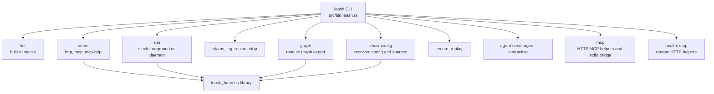

# CLI Binary

This folder contains the `leash` command-line binary. The binary is intentionally thin: it parses commands, resolves config, starts library surfaces, and prints machine-readable output where useful.



## File

- `leash.rs`: Clap command definitions and command handlers for all CLI surfaces.

## Common Commands

```bash
leash list
leash run sim-http
leash serve http --profile sim
leash show-config waveshare-ugv --allow-physical-actuation
leash health --url http://127.0.0.1:8000
leash stop --url http://127.0.0.1:8000
```
